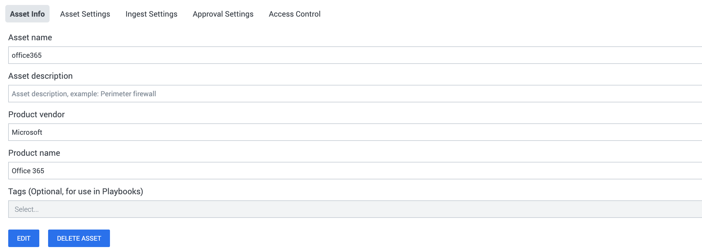
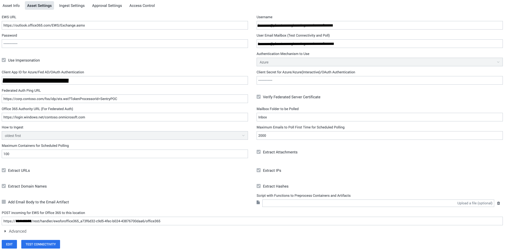

[comment]: # "Auto-generated SOAR connector documentation"
# EWS for Office 365

Publisher: Splunk  
Connector Version: 2.14.0  
Product Vendor: Microsoft  
Product Name: Office 365  
Product Version Supported (regex): ".\*"  
Minimum Product Version: 5.4.0  

This app ingests emails from a mailbox in addition to supporting various investigative and containment actions on an Office 365 service

[comment]: # "File: README.md"
[comment]: # "Copyright (c) 2016-2023 Splunk Inc."
[comment]: # ""
[comment]: # "Licensed under the Apache License, Version 2.0 (the 'License');"
[comment]: # "you may not use this file except in compliance with the License."
[comment]: # "You may obtain a copy of the License at"
[comment]: # ""
[comment]: # "    http://www.apache.org/licenses/LICENSE-2.0"
[comment]: # ""
[comment]: # "Unless required by applicable law or agreed to in writing, software distributed under"
[comment]: # "the License is distributed on an 'AS IS' BASIS, WITHOUT WARRANTIES OR CONDITIONS OF ANY KIND,"
[comment]: # "either express or implied. See the License for the specific language governing permissions"
[comment]: # "and limitations under the License."
[comment]: # ""
## SOAR asset setup

It is not uncommon for enterprises to have a single mailbox configured where users can forward
suspicious emails for further investigation. The ingestion feature in the Office 365 app is
primarily designed to pull emails from such a mailbox and create containers and artifacts in SOAR.

The first thing to do is create the Office 365 asset in SOAR and fill up the required parameters
like **url, username, password** , and **poll_user** . The other values can be left in the default
state for now. The same user can be used to log in/authenticate for the connectivity test and
polling, just specify the same email address in **poll_user** and **username** .  
  
[](img/asset_info.png)  
  
[](img/asset_settings.png)

  

However, it's good practice to set the Label for the objects from this source to a 'NEW ENTRY'
called **Email** .  
  
[](img/ingest_settings.png)  
  
Once the Asset and Ingest parameters are filled, save the asset.

## Authentication

This app supports multiple types of authentication mechanisms. Currently, there are five ways to
authenticate.

-   Basic
-   Azure
-   Azure (interactive)
-   Federated
-   OAuth (client credentials)

For **Azure** , **Azure (interactive)** and **OAuth (client credentials)** mechanisms, you will
first need to create an application on the Azure AD Admin Portal. Follow the steps outlined below to
do this:

-   Navigate to <https://portal.azure.com> in a browser and log in with a Microsoft account.
-   Select **Azure Active Directory** from the list of Azure services.
-   From the left panel, select **App Registrations** .
-   At the top of the middle section, select **New registration** .
-   On the next page, give your application a name and click **Register** .
-   Once the app is created, the **Overview** page opens up. Copy the **Application (client) ID**
    value shown here. Paste this value in the **Client App ID for the Azure/Fed AD/OAuth
    Authentication** asset configuration parameter.
-   Under **Certificates & secrets** select **New client secret** . Note down this key somewhere
    secure, as it cannot be retrieved after closing the window. Provide this value in the **Client
    Secret for the Azure/Fed AD/OAuth Authentication** asset configuration parameter.

  
Following are the instructions to setup different types of authentication.

1.  ### Basic

    Basic is the most simple way to authenticate. All you need to provide to this is Username and
    Password.  
    **NOTE:** Microsoft is going to permanently disable Basic Authentication for EWS. Hence, we
    recommend the customers to switch from Basic to Azure Authentication mechanism. The default
    value of **Authentication Mechanism to Use** asset configuration parameter is therefore changed
    to **Azure** . We will be maintaining the **Basic** option for backward compatibility and for
    any legacy users. As the 'trace email' action uses Basic authentication, it will not be
    functional after Microsoft disables Basic authentication.

2.  ### Azure

    To use this authentication mechanism, you will have to add some permissions to the app you
    created earlier. Follow the steps outlined below to do this:

    -   Under **API Permissions** Click on **Add a permission** .

    -   Under the **Select an API** section, select **APIs my organization uses** .

    -   Search for the **Office 365 Exchange Online** keyword in the search box and click on the
        displayed option for it.

    -   Provide the following Delegated permissions to the app.

          

        -   EWS.AccessAsUser.All
        -   Mail.Read
        -   Mail.Read.All
        -   User.ReadBasic.All (Only required if the asset is configured to use impersonation)

    -   After making these changes, click **Add permissions** at the bottom of the screen, then
        click **Grant admin consent for SOAR** .

3.  ### Azure (interactive)

    To use this authentication mechanism, you will have to add some permissions to the app you
    created earlier. Follow the steps outlined below to do this:

    -   Under **Authentication** , select **Add a platform** . In the **Add a platform** window,
        select **Web** . The **Redirect URIs** should be filled right here. You will obtain the
        redirect URI from the **POST incoming for EWS Office 365 to this location** asset
        configuration parameter.  
        The URI should look similar to this:
        https://\<soar_host>/rest/handler/ewsforoffice365_a73f6d32-c9d5-4fec-b024-43876700daa6/\<asset_name>  
        Once the Redirect URI is filled, click **Configure** .

    -   Under **API Permissions** Click on **Add a permission** .

    -   Under the **Select an API** section, select **APIs my organization uses** .

    -   Search for the **Office 365 Exchange Online** keyword in the search box and click on the
        displayed option for it.

    -   Provide the following Delegated permissions to the app.

          

        -   EWS.AccessAsUser.All
        -   Mail.Read
        -   Mail.Read.All
        -   User.ReadBasic.All (Only required if the asset is configured to use impersonation)

    -   After making these changes, click **Add permissions** at the bottom of the screen, then
        click **Grant admin consent for SOAR** .

    -   Azure adds **Microsoft Graph's User.Read** permission to the app by default. Please confirm
        its presence under the Configured permissions list. If not added, you can manually click on
        **Add a permission** and follow the below steps:

          

        -   Under the **Select an API** section, select **Microsoft APIs** .
        -   Select **Microsoft Graph** from the list.
        -   Provide the **User.Read** Delegated permission to the app.
        -   After making these changes, click **Add permissions** at the bottom of the screen, then
            click **Grant admin consent for SOAR** .

      

    **Azure Interactive** is different because it will prompt the user to log in through Microsoft's
    portal during Test Connectivity, meaning you do not need to enter your password in the asset
    configuration. Instead:

    -   Run **TEST CONNECTIVITY.**
    -   You will be asked to open a link in a new tab. Open the link in the same browser window so
        that you are logged into Splunk SOAR for the redirect.
    -   Proceed to login to the Microsoft site.
    -   You will be prompted to agree to the permissions requested by the App.
    -   If all goes well the browser should instruct you to close the tab.
    -   Now go back and check the message on the Test Connectivity dialog box, it should say
        Connectivity test passed.

    NOTE: Do make sure the base URL is configured for the SOAR instance. You can check it here:
    Administration \> Company Settings \> Info.

4.  ### OAuth (client credentials)

    To use this authentication mechanism, you will have to add some permissions to the app you
    created earlier. Follow the steps outlined below to do this:

    -   Under **API Permissions** Click on **Add a permission** .
    -   Under the **Select an API** section, select **APIs my organization uses** .
    -   Search for the **Office 365 Exchange Online** keyword in the search box and click on the
        displayed option for it.
    -   Provide the **full_access_as_app** Application permission to the app.
    -   After making these changes, click **Add permissions** at the bottom of the screen, then
        click **Grant admin consent for SOAR** .

      

    NOTE: Make sure the **Use Impersonation** option is enabled in the asset while using this
    authentication mechanism. Once it is enabled, you should add email of the impersonating user to
    the action parameter wherever possible while executing an action.

5.  ### Federated

    The Federated Authentication setup is quite complicated and its documentation is out of the
    scope of this section.  
    NOTE: Federated Authentication has been tested in a limited fashion.

NOTE: The user must test the connectivity every time they switch between different authentication
mechanisms.

## Impersonation

If you wish to use a single login user to read and modify multiple mailboxes (of multiple users),
proper permissions to allow impersonation must be enabled on the login user. If impersonation is not
enabled/working, you may need to enable it by configuring the roles for the user.

-   First, log in to <https://outlook.office365.com/ecp/> as an admin user

-   Click on **admin roles** under the **permissions** section

-   Press the '+' button on the top left to create a new role group

      

    -   Give the group a friendly name and description
    -   Add the role **ApplicationImpersonation**
    -   Assign the user to the members of this group

-   Click save, and wait. These changes will take a while to affect. You may need to wait up to an
    hour for impersonation to start working in the App.

## Connectivity test

Once the asset is saved, run Test Connectivity and make sure it passes. The Test Connectivity action
attempts to read some information about the configured user's mailbox to validate the Auth
parameters. Exchange Web Services API is used for all the actions. Impersonation is also used if
configured.  
  
[](img/testing_connectivity.png)

Now that the config is out of the way, let's delve into the two modes that ingestion can occur and
the differences between them. One thing to note is that for every email that is ingested, a single
container is created containing multiple artifacts.

## POLL NOW

POLL NOW should be used to get a sense of the containers and artifacts that are created by the app.
The POLL NOW window allows the user to set the "Maximum containers" that should be ingested at this
instance. Since a single container is created for each email, this value equates to the maximum
number of emails that are ingested by the app. The app will either get the oldest email first or the
latest, depending upon the configuration parameter *How to ingest* . The date used to determine the
oldest or latest is what EWS calls **item:LastModifiedTime** . This value is different than the mail
creation time. For example, if an email that arrived a week ago, is moved from one folder to the
folder being ingested, its LastModifiedTime will be set to the time that it was moved.

## Scheduled Polling

This mode is used to schedule a polling action on the asset at regular intervals, which is
configured via the INGEST SETTINGS tab of the asset. It makes use of the following asset
configuration parameters (among others):

-   Maximum emails to poll the first time

      
    The app detects the first time it is polling an asset and will ingest this number of emails (at
    the most).

-   Maximum emails to poll

      
    For all scheduled polls after the first, the app will ingest this number of emails.

-   How to ingest

      
    Should the app be ingesting the latest emails or the oldest.

In the case of Scheduled Polling, on every poll, the app remembers the last email that it has
ingested and will pick up from the next one in the next scheduled poll.

## How to ingest

The app allows the user to configure how it should ingest emails on every scheduled poll either in
the *oldest first* or the *latest first* order. Depending upon the scheduled interval and how busy
the folder is, one of the following could potentially happen

-   oldest first

      
    If the app is configured to poll too slowly and the folder is so busy that on every poll the
    maximum ingested emails is less than the number of new emails, the app will never catch up.

-   latest first

      
    If the app is configured to poll too slowly and the folder is so busy that on every poll the
    maximum ingested emails is less than the number of new emails, the app will drop the older
    emails since it is ingesting the latest emails that came into the mailbox.

For best results, keep the poll interval and *Maximum emails to poll* values close to the number of
emails you would get within a time interval. This way, every poll will end up ingesting all the new
emails.  

## Containers created

As mentioned before, the app will create a single container for each email that it ingests with the
following properties:

-   Name

      
    The email subject is used as the name of the container. If a subject is not present the
    generated name is set to the unique message ID that office 365 assigns to every mail in the
    mailboxes

-   Source ID

      
    The source ID of the container will be set to the unique message id.

-   Data Key

      
    The Container dictionary contains a data section that looks like the following:

        "data": { "raw_email": "...Parsed Email....", "base64encoded": False}

    If the App decides to encode the raw_email in base64, the *base64encoded* key will be set to
    True

## Artifacts created

The app will create the following type of artifacts:

-   Email Artifact

      
    The email addresses that are found in the ingested email will be added as a separate artifact.
    Any attached email will also be scanned and the address present in the attached email will be
    added as a separate artifact. The emails are added as custom strings in the cef structure in the
    following manner.  
    [](img/email_artifact.png)  

-   IP Artifact
    -   If **extract_ips** is enabled, any IPv4 or IPv6 found in the email body will be added, with
        one CEF per IP.
    -   Any IP addresses found in the email are added to the CEF structure of an artifact.
    -   The CEF for an IP is cef.sourceAddress.

-   Hash Artifact - cef.fileHash

      

    -   If **extract_hashes** is enabled, any hash found in the email body will be added, with one
        CEF per hash.
    -   Any Hashes found in the email are added to the CEF structure of an artifact.
    -   The CEF for a hash is cef.fileHash.

-   URL Artifact - cef.requestURL

      

    -   If **extract_urls** is enabled, any url found in the email body will be added, with one CEF
        per url.
    -   Any URLs found are added to the CEF structure of an artifact.
    -   The CEF for a URL is cef.requestURL.

-   Domain Artifact - cef.destinationDnsDomain

      

    -   If **extract_domains** is enabled, any domain found in the email body will be added, with
        one CEF per domain.
    -   Domains that are part of a URL or an email address are added to the CEF structure of an
        artifact.
    -   The CEF for a URL is cef.destinationDnsDomain.

-   Vault Artifact

    -   If the email contains any attachments, these are extracted (if **extract_attachments** is
        enabled) and added to the vault of the Container.
    -   At the same time, the vault ID and file name of this item is represented by a Vault
        Artifact.
    -   The same file can be added to the vault multiple times. In this scenario, the file name of
        the item added the second time onwards will be slightly different, but the vault ID will
        still be the same. However, there will be multiple artifacts created.
    -   Do note that the system does *not* duplicate the file bytes, only the metadata in the
        database.
    -   You will notice additional CEF fields **cs6** (value is the Vault ID) and **cs6Label** .
        These are added for backward compatibility only and will be deprecated in future releases.
        Please don't use these keys in playbooks.

      
      
    [](img/vault_artifact.png)

## Guidelines to provide folder path parameter value

This is applicable to 'copy email', 'move email', and 'run query' actions.

-   To specify the complete path, use the **'/'** (forward slash) as the separator.
-   If a folder name has a literal forward slash in the name escape it with a **'\\'** (backslash)
    to differentiate.
-   For example, to search in a folder named **test/exp** which is nested within (is a child of)
    **Inbox** , set the value as **Inbox/test\\/exp** .

## outlookmsgfile

This app uses the outlookmsgfile module, which is licensed under the MIT License, Copyright (c) 2018
Joshua Tauberer.

## compoundfiles

This app uses the compoundfiles module, which is licensed under the MIT License, Copyright (c) 2014
Dave Jones.

## compressed_rtf

This app uses the compressed_rtf module, which is licensed under the MIT License, Copyright (c) 2016
Dmitry Alimov.

## Preprocessing Containers

It is possible to upload your own script which has functions to handle preprocessing of containers.
The artifacts which are going to be added with the container can be accessed through this container
as well. This function should accept a container and return the updated container. Also note that
the name of this function must be **preprocess_container** .

``` shell
import urlparse


def get_host_from_url(url):
    return urlparse.urlparse(url).hostname


def preprocess_container(container):

    # Match urls like https://secure.contoso.com/link/https://www.google.com
    # We want to strip 'https://secure.contoso.com/link/', and instead create
    #  a URL artifact for 'https://www.google.com'
    url_prepend = 'https://secure.contoso.com/link/'
    domain_prepend = 'secure.contoso.com'

    new_artifacts = []

    for artifact in container.get('artifacts', []):
        cef = artifact.get('cef')
        url = cef.get('requestURL')
        if url and url.lower().startswith(url_prepend):
            url = url.replace(url_prepend, '')
            artifact['cef']['requestURL'] = url
            # Create a new domain artifact for this URL
            new_artifacts.append({
                'name': 'Domain Artifact',
                'cef': {
                    'destinationDnsDomain': get_host_from_url(url)
                }
            })

        domain = cef.get('destinationDnsDomain')
        if domain and domain.lower() == domain_prepend:
            # These are the wrong domains, ignore them
            continue

        new_artifacts.append(artifact)

    if new_artifacts:
        new_artifacts[-1]['run_automation'] = True

    container['artifacts'] = new_artifacts
    return container
```

In this example, many of the URLs have 'https://secure.contoso.com/link' appended to the start of
them. These URL artifacts will be tough to use in a playbook without additional processing. On top
of that, all of the associated domain artifacts will be incorrect as well, since they will all point
to 'secure.contoso.com'.

## Increase the maximum limit for ingestion

The steps are as follows:

1.  Open the **/opt/phantom/usr/nginx/conf/conf.d/phantom-nginx-server.conf** file on the SOAR
    instance.
2.  Change that value of the **client_max_body_size** variable as per your needs.
3.  Save the configuration file.
4.  Reload nginx service using **service nginx reload** or try restarting the nginx server from SOAR
    platform: Go to **Administrator->System Health-> System Health** then restart the nginx server.

## Port Information

The app uses HTTP/ HTTPS protocol for communicating with the Office365 server. Below are the default
ports used by Splunk SOAR.

|         Service Name | Transport Protocol | Port |
|----------------------|--------------------|------|
|         http         | tcp                | 80   |
|         https        | tcp                | 443  |


### Configuration Variables
The below configuration variables are required for this Connector to operate.  These variables are specified when configuring a Office 365 asset in SOAR.

VARIABLE | REQUIRED | TYPE | DESCRIPTION
-------- | -------- | ---- | -----------
**url** |  required  | string | EWS URL
**username** |  required  | string | Username
**password** |  optional  | password | Password
**poll_user** |  optional  | string | User Email Mailbox (Test Connectivity and Poll)
**use_impersonation** |  optional  | boolean | Use Impersonation
**auth_type** |  optional  | string | Authentication Mechanism to Use
**client_id** |  optional  | string | Client App ID for Azure/Fed AD/OAuth Authentication
**client_secret** |  optional  | password | Client Secret for Azure/Azure(Interactive)/OAuth Authentication
**fed_ping_url** |  optional  | string | Federated Auth Ping URL
**fed_verify_server_cert** |  optional  | boolean | Verify Federated Server Certificate
**authority_url** |  optional  | string | Office 365 Authority URL (For Federated Auth)
**poll_folder** |  required  | string | Mailbox Folder to be Polled
**ingest_manner** |  required  | string | How to Ingest
**first_run_max_emails** |  required  | numeric | Maximum Emails to Poll First Time for Scheduled Polling
**max_containers** |  required  | numeric | Maximum Containers for Scheduled Polling
**timeout** |  optional  | numeric | Request Timeout (Default: 60 seconds)
**extract_attachments** |  optional  | boolean | Extract Attachments
**extract_urls** |  optional  | boolean | Extract URLs
**extract_ips** |  optional  | boolean | Extract IPs
**extract_domains** |  optional  | boolean | Extract Domain Names
**extract_hashes** |  optional  | boolean | Extract Hashes
**extract_eml** |  optional  | boolean | Extract root (primary) email as Vault
**add_body_to_header_artifacts** |  optional  | boolean | Add Email Body to the Email Artifact
**preprocess_script** |  optional  | file | Script with Functions to Preprocess Containers and Artifacts

### Supported Actions  
[test connectivity](#action-test-connectivity) - Validate the asset configuration for connectivity  
[run query](#action-run-query) - Search emails  
[delete email](#action-delete-email) - Delete emails  
[copy email](#action-copy-email) - Copy an email to a folder  
[move email](#action-move-email) - Move an email to a folder  
[block sender](#action-block-sender) - Add the sender email into the block list  
[unblock sender](#action-unblock-sender) - Remove the sender email from the block list  
[get email](#action-get-email) - Get an email from the server  
[list addresses](#action-list-addresses) - Get the email addresses that make up a Distribution List  
[lookup email](#action-lookup-email) - Resolve an Alias name or email address, into mailboxes  
[update email](#action-update-email) - Update an email on the server  
[trace email](#action-trace-email) - Get message trace from the server  
[on poll](#action-on-poll) - Action handler for the ingest functionality  

## action: 'test connectivity'
Validate the asset configuration for connectivity

Type: **test**  
Read only: **True**

To check the connection and credentials, this action tries to list the email ids of the configured <b>poll_user</b>.

#### Action Parameters
No parameters are required for this action

#### Action Output
No Output  

## action: 'run query'
Search emails

Type: **investigate**  
Read only: **True**

The <b>run query</b> action provides more than one method to search a user's mailbox:<br><ul><li>Simple Search<br>Use the <b>subject</b> and <b>body</b> parameters to search for substring matches. The <b>sender</b> parameter can be used to search for emails from a specific address. However, it has been noticed that a match with the <b>sender</b> email address fails for emails that have been never sent or received, but instead have been created manually as a draft and copied to the searched mailbox. In such cases, an AQS is a better option. If more than one parameter is specified, the search is an <b>And</b> of the given values including the <b>internet_message_id</b>.<br> <b>Simple Search</b> implements search filters. More details regarding search filters can be found on this <a href="https://msdn.microsoft.com/en-us/library/office/dn579422(v=exchg.150).aspx" target="_blank">MSDN Link</a>.<br></li><li>Query Search<br>For a more fine-grained email search, the use of the <b>query</b> parameter is recommended. If this parameter is specified, the <b>subject</b>, <b>internet_message_id</b>, and <b>body</b> parameters are ignored.<br>This parameter supports AQS queries to search in a Mailbox. More details regarding AQS keywords supported by Exchange can be found on this <a href="https://msdn.microsoft.com/en-us/library/office/dn579420(v=exchg.150).aspx" target="_blank">MSDN Link.</a><br>Searching with AQS strings does have one notable restriction, however. The AQS search string will only match substrings from the start of a word. If a substring needs to be found in the middle of a word, use a <b>Simple Search</b>.<br>Some examples:<br><ul><li>All emails from user1@contoso.com or user2@contoso.com<br>from:user1@contoso.com OR from:user2@contoso.com</li><li>All emails containing the string <i>free vacations</i><br>body: free vacations</li><li>This will match an email with subject containing the word <i>Details</i> but not <i>Cadet</i><br>subject:det</li></li></ul></ul>If the <b>folder</b> parameter is not specified, each email based folder such as Inbox, Sent, etc. will be searched, including the children (nested) folders.<br>The action supports searching for a folder that is nested within another.<br>To search in such a folder, specify the complete path using the <b>'/'</b> (forward slash) as the separator.<br>For e.g. to search in a folder named <i>phishing</i> which is nested within (is a child of) <i>Inbox</i>, set the value as <b>Inbox/phishing</b>. If a folder name has a literal forward slash in the name escape it with a backslash to differentiate.<br>NOTE: In some cases, search results may return more emails than are visible in an email client. This is due to emails that have been just deleted, but not yet completely cleaned by the server.<br><br>The action supports limiting the number of emails returned using the <b>range</b> parameter. The input should be of the form <i>min_offset</i>-<i>max_offset</i>. The results are always sorted in <i>descending</i> order to place the latest emails at the top. For example to get the latest 10 emails that matched the filter, specify the range as 0-9. If multiple folders are searched for, then the range will be applied for each folder.<br>So if the folder being searched for example <i>Inbox</i> has a child (nested) folder called <i>phishing</i> and the range specified is 2-10, then the action will return 9 max emails for each folder. If the range parameter is not specified by default the action will use <b>0-10</b>.<br><br>NOTE: The <b>email</b> parameter is required.<br><br>Many actions such as <b>delete email</b> and <b>copy email</b> require the <b>Office 365 email ID</b> as input. Many times this value is not easily available, since not many email clients display it. However, every email header has a value called <b>Message-ID</b> assigned to it. It's usually something like &lt;tS10Ncty2SyeJsjdNMsxV+dguQ+jd7RwiFgmZsLN@contoso.com&gt;. Use this as the value (including the &lt; and &gt; chars if present) of <b>internet_message_id</b> parameter and execute the action. The results will contain the <b>Office 365 email ID</b> of an email, which can be used as input for other actions.

#### Action Parameters
PARAMETER | REQUIRED | DESCRIPTION | TYPE | CONTAINS
--------- | -------- | ----------- | ---- | --------
**email** |  required  | User's email (Mailbox to search in) | string |  `email` 
**folder** |  optional  | Folder name/path (to search in) | string |  `mail folder`  `mail folder path` 
**subject** |  optional  | Substring to search in subject | string | 
**sender** |  optional  | Sender email address to match | string |  `email` 
**body** |  optional  | Substring to search in body | string | 
**internet_message_id** |  optional  | Internet message ID | string |  `internet message id` 
**query** |  optional  | AQS string | string | 
**range** |  optional  | Email range to return (min_offset-max_offset) | string | 
**ignore_subfolders** |  optional  | Ignore subfolders | boolean | 

#### Action Output
DATA PATH | TYPE | CONTAINS | EXAMPLE VALUES
--------- | ---- | -------- | --------------
action_result.status | string |  |   success  failed 
action_result.parameter.body | string |  |   Text body 
action_result.parameter.email | string |  `email`  |   user@example.onmicrosoft.com 
action_result.parameter.folder | string |  `mail folder`  `mail folder path`  |   Archive 
action_result.parameter.ignore_subfolders | boolean |  |   True  False 
action_result.parameter.internet_message_id | string |  `internet message id`  |   CAOj3gTm-8BRJ_v+=UPGqCcBFRbUPFn9cspjZJs=P4PPWL34-2Q@mail.gmail.com 
action_result.parameter.query | string |  |   subject:test AND from:"User Name" 
action_result.parameter.range | string |  |   0-10 
action_result.parameter.sender | string |  `email`  |   user@example.onmicrosoft.com 
action_result.parameter.subject | string |  |   Task Update 
action_result.data.\*.folder | string |  `mail folder`  |  
action_result.data.\*.folder_path | string |  `mail folder path`  |  
action_result.data.\*.t_DateTimeReceived | string |  |  
action_result.data.\*.t_From.t_Mailbox.t_EmailAddress | string |  `email`  |  
action_result.data.\*.t_From.t_Mailbox.t_MailboxType | string |  |  
action_result.data.\*.t_From.t_Mailbox.t_Name | string |  |  
action_result.data.\*.t_From.t_Mailbox.t_RoutingType | string |  |  
action_result.data.\*.t_InternetMessageId | string |  `internet message id`  |  
action_result.data.\*.t_ItemId.@ChangeKey | string |  |  
action_result.data.\*.t_ItemId.@Id | string |  `exchange email id`  `office 365 email id`  |  
action_result.data.\*.t_Sender.t_Mailbox.t_EmailAddress | string |  `email`  |  
action_result.data.\*.t_Sender.t_Mailbox.t_MailboxType | string |  |  
action_result.data.\*.t_Sender.t_Mailbox.t_Name | string |  |  
action_result.data.\*.t_Sender.t_Mailbox.t_RoutingType | string |  |  
action_result.data.\*.t_Subject | string |  |  
action_result.summary.emails_matched | numeric |  |  
action_result.message | string |  |   Emails matched: 7 
summary.total_objects | numeric |  |   1 
summary.total_objects_successful | numeric |  |   1   

## action: 'delete email'
Delete emails

Type: **contain**  
Read only: **False**

This action supports a comma-separated list of message IDs as input, which should be used to delete multiple emails in a single call to the server. The deleted emails are moved to the Deleted Items (trash) folder.

#### Action Parameters
PARAMETER | REQUIRED | DESCRIPTION | TYPE | CONTAINS
--------- | -------- | ----------- | ---- | --------
**id** |  required  | Message IDs to delete (comma-separated values supported) | string |  `exchange email id`  `office 365 email id` 
**email** |  optional  | Email of the mailbox owner (used during impersonation) | string |  `email` 

#### Action Output
DATA PATH | TYPE | CONTAINS | EXAMPLE VALUES
--------- | ---- | -------- | --------------
action_result.status | string |  |   success  failed 
action_result.parameter.email | string |  `email`  |   user@example.onmicrosoft.com 
action_result.parameter.id | string |  `exchange email id`  `office 365 email id`  |   AQMkADU3NDk3MzJlLTY3MDQtNDE2Ny1iZDk1LTc4YjEwYzhmZDc5YQBGAAADyW3X5P7Hb0_MMHKonvdoWQcAQSl1b8BFiEmbqZql_JiUtwAAAgEMAAAAQSl1b8BFiEmbqZql_JiUtwABS2DpdwAAAA== 
action_result.data | string |  |  
action_result.summary | string |  |  
action_result.message | string |  |   Successfully deleted email 
summary.total_objects | numeric |  |   1 
summary.total_objects_successful | numeric |  |   1   

## action: 'copy email'
Copy an email to a folder

Type: **generic**  
Read only: **False**

The action supports copying to a folder that is nested within another.<br>To copy to such a folder, specify the complete path using the <b>'/'</b> (forward slash) as the separator.<br>For e.g. to copy email to a folder named <i>phishing</i> which is nested within (is a child of) <i>Inbox</i>, set the value as <b>Inbox/phishing</b>. If a folder name has a literal forward slash in the name escape it with a backslash to differentiate.<br>The action requires the <b>Office 365 email ID</b> as input. Many times this value is not easily available, since not many email clients display it. However, every email header has a value called <b>Message-ID</b> assigned to it. It's usually something like &lt;tS10Ncty2SyeJsjdNMsxV+dguQ+jd7RwiFgmZsLN@contoso.com&gt;. Use this <b>Internet Message ID</b> as input to the <b>run query</b> action to get the <b>Office 365 email ID</b> of an email.<br>The action will return the ID of the newly copied email in the data path <b>action_result.data.\*.new_email_id</b>, however, this value is not available for cross-mailbox or mailbox to public folder <b>copy email</b> actions (please see the documentation of the <a href="https://msdn.microsoft.com/en-us/library/office/aa565012(v=exchg.150).aspx" target="_blank">CopyItem operation on MSDN</a>). However, in such scenarios, do a <b>run query</b> on the new mailbox plus folder with a specific parameter like <b>Internet Message ID</b> to get the <b>Office 365 email ID</b>.<br><br><b>Impersonation</b><p>Impersonation plays a big role in the <b>copy email</b> action, for reasons explained in this section, <b>copy email</b> is the only action that overrides the asset config parameter <b>use_impersonation</b>. By default, the action will <i>impersonate</i> the user specified in the <b>email</b> parameter, if impersonation is enabled (by setting the <b>dont_impersonate</b> action parameter to False or Unchecked).<br>However, depending on the server configuration, this action might fail with an <i>Access Denied</i> error. If an email is being copied from one folder to another in the same mailbox, the action will succeed, however, if the email is being copied from one mailbox's folder to a different mailbox, the impersonated user will require access to both the mailboxes. In this case, the action might require to impersonate a user other than the one specified in the <b>email</b> parameter. In such a scenario use the <b>impersonate_email</b> to specify an alternate email to <i>impersonate</i>.<br>Set the <b>dont_impersonate</b> parameter to <b>True</b> to disable impersonation all together. This value will override the one configured on the asset. The default value of this param is <b>False</b>.</p>

#### Action Parameters
PARAMETER | REQUIRED | DESCRIPTION | TYPE | CONTAINS
--------- | -------- | ----------- | ---- | --------
**id** |  required  | Message ID to copy | string |  `exchange email id`  `office 365 email id` 
**email** |  required  | Destination mailbox (Email) | string |  `email` 
**folder** |  required  | Destination mail folder name/path | string |  `mail folder`  `mail folder path` 
**impersonate_email** |  optional  | Impersonation email | string |  `email` 
**dont_impersonate** |  optional  | Don't use impersonation | boolean | 
**is_public_folder** |  optional  | Mailbox folder is a public folder | boolean | 

#### Action Output
DATA PATH | TYPE | CONTAINS | EXAMPLE VALUES
--------- | ---- | -------- | --------------
action_result.status | string |  |   success  failed 
action_result.parameter.dont_impersonate | boolean |  |   True  False 
action_result.parameter.email | string |  `email`  |   user@example.onmicrosoft.com 
action_result.parameter.folder | string |  `mail folder`  `mail folder path`  |   Inbox/myfolder 
action_result.parameter.id | string |  `exchange email id`  `office 365 email id`  |   AQMkADU3NDk3MzJlLTY3MDQtNDE2Ny1iZDk1LTc4YjEwYzhmZDc5YQBGAAADyW3X5P7Hb0_MMHKonvdoWQcAQSl1b8BFiEmbqZql_JiUtwAAAgEMAAAAQSl1b8BFiEmbqZql_JiUtwABS2DpdwAAAA== 
action_result.parameter.impersonate_email | string |  `email`  |   user@example.onmicrosoft.com 
action_result.parameter.is_public_folder | boolean |  |   True  False 
action_result.data.\*.new_email_id | string |  `exchange email id`  `office 365 email id`  |   AAMkADVjNTI3MTYxLTYyZDMtNGViYy04MTFhLWZjYjQxYzNmNmI2YwBGAAAAAACJMZRks2m2Qp8kJOYtQ/E0BwC63sxpeq+QSJSiCN540EaIAAAAAAEbAAC63sxpeq+QSJSiCN540EaIAAHWGokmAAA= 
action_result.summary | string |  |  
action_result.message | string |  |   Successfully copied email 
summary.total_objects | numeric |  |   1 
summary.total_objects_successful | numeric |  |   1   

## action: 'move email'
Move an email to a folder

Type: **generic**  
Read only: **False**

The action supports moving an email to a folder that is nested within another.<br>To move to such a folder, specify the complete path using the <b>'/'</b> (forward slash) as the separator.<br>For example, to move an email to a folder named <i>phishing</i> which is nested within <i>Inbox</i>, set the value as <b>Inbox/phishing</b>.<br>The action requires the exchange email ID as input. Many times this value is not easily available, since not many email clients display it. However, every email header has a value called <b>Message-ID</b> assigned to it. It's usually something like &lt;tS10Ncty2SyeJsjdNMsxV+dguQ+jd7RwiFgmZsLN@contoso.com&gt;. Use this <b>Internet Message ID</b> as input to the <b>run query</b> action to get the <b>exchange email ID</b> of an email.<br>The action will return the ID of the newly copied email in the data path <b>action_result.data.\*.new_email_id</b>, however, this value is not available for cross-mailbox or mailbox to public folder <b>move email</b> actions (please see the documentation of the <a href="https://msdn.microsoft.com/en-us/library/office/aa565012(v=exchg.150).aspx" target="_blank">MoveItem operation on MSDN</a>). However, in such scenarios, do a <b>run query</b> on the new mailbox plus folder with a specific parameter like <b>Internet Message ID</b> to get the <b>Exchange email ID</b>.<br><br><b>Impersonation</b><p>Impersonation plays a big role in the <b>move email</b> action, for reasons explained in this section, <b>move email</b> is the only action that overrides the asset config parameter <b>use_impersonation</b>. By default, the action will <i>impersonate</i> the user specified in the <b>email</b> parameter, if impersonation is enabled (by setting the <b>dont_impersonate</b> action parameter to False or Unchecked).<br>However, depending on the server configuration, this action might fail with an <i>Access Denied</i> error. If an email is being copied from one folder to another in the same mailbox, the action will succeed, however, if the email is being copied from one mailbox's folder to a different mailbox, the impersonated user will require access to both the mailboxes. In this case, the action might require to impersonate a user other than the one specified in the <b>email</b> parameter. In such a scenario use the <b>impersonate_email</b> to specify an alternate email to <i>impersonate</i>.<br>Set the <b>dont_impersonate</b> parameter to <b>True</b> to disable impersonation all together. This value will override the one configured on the asset. The default value of this param is <b>False</b>.</p>

#### Action Parameters
PARAMETER | REQUIRED | DESCRIPTION | TYPE | CONTAINS
--------- | -------- | ----------- | ---- | --------
**id** |  required  | Message ID to move | string |  `exchange email id`  `office 365 email id` 
**email** |  required  | Destination Mailbox (Email) | string |  `email` 
**folder** |  required  | Destination Mail Folder Name/Path | string |  `mail folder`  `mail folder path` 
**impersonate_email** |  optional  | Impersonation Email | string |  `email` 
**dont_impersonate** |  optional  | Don't use impersonation | boolean | 
**is_public_folder** |  optional  | Mailbox folder is a public folder | boolean | 

#### Action Output
DATA PATH | TYPE | CONTAINS | EXAMPLE VALUES
--------- | ---- | -------- | --------------
action_result.status | string |  |   success  failed 
action_result.parameter.dont_impersonate | boolean |  |   True  False 
action_result.parameter.email | string |  `email`  |   user@example.onmicrosoft.com 
action_result.parameter.folder | string |  `mail folder`  `mail folder path`  |   Inbox/myfolder 
action_result.parameter.id | string |  `exchange email id`  `office 365 email id`  |   AQMkADU3NDk3MzJlLTY3MDQtNDE2Ny1iZDk1LTc4YjEwYzhmZDc5YQBGAAADyW3X5P7Hb0_MMHKonvdoWQcAQSl1b8BFiEmbqZql_JiUtwAAAgEMAAAAQSl1b8BFiEmbqZql_JiUtwABS2DpdwAAAA== 
action_result.parameter.impersonate_email | string |  `email`  |   user@example.onmicrosoft.com 
action_result.parameter.is_public_folder | boolean |  |   True  False 
action_result.data.\*.new_email_id | string |  `exchange email id`  `office 365 email id`  |   AAMkADVjNTI3MTYxLTYyZDMtNGViYy04MTFhLWZjYjQxYzNmNmI2YwBGAAAAAACJMZRks2m2Qp8kJOYtQ/E0BwC63sxpeq+QSJSiCN540EaIAAAAAAEbAAC63sxpeq+QSJSiCN540EaIAAHWGokmAAA= 
action_result.summary | string |  |  
action_result.message | string |  |   Successfully moved 
summary.total_objects | numeric |  |   1 
summary.total_objects_successful | numeric |  |   1   

## action: 'block sender'
Add the sender email into the block list

Type: **contain**  
Read only: **False**

This action takes as input an email whose sender will be added to the Block Senders List. The message ID changes after the execution and is a required parameter for request hence undo action would require unique ID. Note that a message from the email address must exist in the user's mailbox before you can add the email address to or remove it from the Blocked Senders List.<ul><li>If the <b>move_to_junk_folder</b> parameter is set to True, the sender of the target email message is added to the blocked sender list and the email message is moved to the Junk Email folder.</li><li>If the <b>move_to_junk_folder</b> attribute is set to False, the sender of the target email message is added to the blocked sender list and the email message is not moved from the folder.</li></ul>To view the current Block Senders list, please read the following Powershell articles: <ul><li>https://docs.microsoft.com/en-us/powershell/exchange/exchange-online/connect-to-exchange-online-powershell/connect-to-exchange-online-powershell?view=exchange-ps</li><li>https://docs.microsoft.com/en-us/powershell/module/exchange/antispam-antimalware/Get-MailboxJunkEmailConfiguration?view=exchange-ps</li></ul>

#### Action Parameters
PARAMETER | REQUIRED | DESCRIPTION | TYPE | CONTAINS
--------- | -------- | ----------- | ---- | --------
**id** |  required  | Message ID to pick the sender of | string |  `exchange email id`  `office 365 email id` 
**move_to_junk_folder** |  optional  | Should the email be moved to the junk folder | boolean | 
**email** |  optional  | Email of the mailbox owner (used during impersonation) | string |  `email` 

#### Action Output
DATA PATH | TYPE | CONTAINS | EXAMPLE VALUES
--------- | ---- | -------- | --------------
action_result.status | string |  |   success  failed 
action_result.parameter.email | string |  `email`  |   foo@bar.onmicrosoft.com 
action_result.parameter.id | string |  `exchange email id`  `office 365 email id`  |   AAMkADVjNTI3MTYxLTYyZDMtNGViYy04MTFhLWZjYjQxYzNmNmI2YwBGAAAAAACJMZRks2m2Qp8kJOYtQ/E0BwC63sxpeq+QSJSiCN540EaIAAAAAAEMAAC63sxpeq+QSJSiCN540EaIAAHWGo0OAAA= 
action_result.parameter.move_to_junk_folder | boolean |  |   True  False 
action_result.data.\*.new_email_id | string |  `exchange email id`  `office 365 email id`  |   AAMkADVjNTI3MTYxLTYyZDMtNGViYy04MTFhLWZjYjQxYzNmNmI2YwBGAAAAAACJMZRks2m2Qp8kJOYtQ/E0BwC63sxpeq+QSJSiCN540EaIAAAAAAEbAAC63sxpeq+QSJSiCN540EaIAAHWGokmAAA= 
action_result.summary.new_email_id | string |  |   AAMkADVjNTI3MTYxLTYyZDMtNGViYy04MTFhLWZjYjQxYzNmNmI2YwBGAAAAAACJMZRks2m2Qp8kJOYtQ/E0BwC63sxpeq+QSJSiCN540EaIAAAAAAEbAAC63sxpeq+QSJSiCN540EaIAAHWGokmAAA= 
action_result.message | string |  |   Sender blocked. Message moved to Junk Folder 
summary.total_objects | numeric |  |   1 
summary.total_objects_successful | numeric |  |   1   

## action: 'unblock sender'
Remove the sender email from the block list

Type: **correct**  
Read only: **False**

This action takes as input an email whose sender will be removed from the Block Senders List. The message ID changes after the execution and is a required parameter for request hence undo action would require unique ID. Note that a message from the email address must exist in the user's mailbox before you can add the email address to or remove it from the Blocked Senders List.<ul><li>If the <b>move_from_junk_folder</b> parameter is set to True, the sender of the target email message is removed from the blocked sender list and the email message is moved from the Junk Email folder.</li><li>If the <b>move_from_junk_folder</b> attribute is set to False, the sender of the target email message is removed from the blocked sender list and the email message is not moved from the folder.</li></ul>To view the current Block Senders list, please read the following Powershell articles: <ul><li>https://docs.microsoft.com/en-us/powershell/exchange/exchange-online/connect-to-exchange-online-powershell/connect-to-exchange-online-powershell?view=exchange-ps</li><li>https://docs.microsoft.com/en-us/powershell/module/exchange/antispam-antimalware/Get-MailboxJunkEmailConfiguration?view=exchange-ps</li></ul>

#### Action Parameters
PARAMETER | REQUIRED | DESCRIPTION | TYPE | CONTAINS
--------- | -------- | ----------- | ---- | --------
**id** |  required  | Message ID to pick the sender of | string |  `exchange email id`  `office 365 email id` 
**move_from_junk_folder** |  optional  | Should the email be moved out of the junk folder | boolean | 
**email** |  optional  | Email of the mailbox owner (used during impersonation) | string |  `email` 

#### Action Output
DATA PATH | TYPE | CONTAINS | EXAMPLE VALUES
--------- | ---- | -------- | --------------
action_result.status | string |  |   success  failed 
action_result.parameter.email | string |  `email`  |   foo@bar.onmicrosoft.com 
action_result.parameter.id | string |  `exchange email id`  `office 365 email id`  |   AAMkADVjNTI3MTYxLTYyZDMtNGViYy04MTFhLWZjYjQxYzNmNmI2YwBGAAAAAACJMZRks2m2Qp8kJOYtQ/E0BwC63sxpeq+QSJSiCN540EaIAAAAAAEbAAC63sxpeq+QSJSiCN540EaIAAHWGokmAAA= 
action_result.parameter.move_from_junk_folder | boolean |  |   True  False 
action_result.data.\*.new_email_id | string |  `exchange email id`  `office 365 email id`  |   AAMkADVjNTI3MTYxLTYyZDMtNGViYy04MTFhLWZjYjQxYzNmNmI2YwBGAAAAAACJMZRks2m2Qp8kJOYtQ/E0BwC63sxpeq+QSJSiCN540EaIAAAAAAEMAAC63sxpeq+QSJSiCN540EaIAAHWGo0PAAA= 
action_result.summary.new_email_id | string |  `exchange email id`  `office 365 email id`  |   AAMkADVjNTI3MTYxLTYyZDMtNGViYy04MTFhLWZjYjQxYzNmNmI2YwBGAAAAAACJMZRks2m2Qp8kJOYtQ/E0BwC63sxpeq+QSJSiCN540EaIAAAAAAEMAAC63sxpeq+QSJSiCN540EaIAAHWGo0PAAA= 
action_result.message | string |  |   Sender Unblocked. Message moved out of Junk Folder 
summary.total_objects | numeric |  |   1 
summary.total_objects_successful | numeric |  |   1   

## action: 'get email'
Get an email from the server

Type: **investigate**  
Read only: **True**

Every container that is created by the app has the following values:<ul><li>The container ID that is generated by the SOAR platform.</li><li>The Source ID that the app equates to the email ID on the server if known or the vault ID if asked to parse from the vault.</li><li>The raw_email data in the container's data field is set to the RFC822 format of the email.</li></ul>This action parses email data and if specified create containers and artifacts. The email data to parse is either extracted from the remote server if an email ID is specified, from a SOAR container, if the <b>container_id</b> is specified or from the vault item if the <b>vault_id</b> is specified.<br>If all three parameters are specified, the action will use the <b>container_id</b>.<br>The data paths differ depending on where the email data is parsed from.<br><br><p>If parsed from the server:<br><ul><li>The data path <b>action_result.data.\*.t_MimeContent.#text</b> contains the email in RFC822 format but base64 encoded.</li><li>The data path <b>action_result.data.\*.t_Body.#text</b> contains the email body.</li><li>The widget for this action will render a text version of the email body if possible.</li><li>If impersonation is enabled on the asset, the <b>email</b> parameter is required, else <b>email</b> will be ignored.</li></ul></p><p>If parsed from the container or vault:<br><ul><li>The widget does not render the email body.</li><li>The email headers are listed in a table.</li></ul></p><p>If <b>ingest_email</b> is set to </b>True</b>:<br><ul><li>The ID of the container created or updated will be set in the <b>action_result.summary.container_id</b> data path</li><li>The widget will display this ID as <b>Ingested Container ID</b></li></ul></p>Do note that any containers and artifacts created will use the label configured in the asset.<br>The action will fail if the vault item asked to parse and ingest is not a valid MSG file.

#### Action Parameters
PARAMETER | REQUIRED | DESCRIPTION | TYPE | CONTAINS
--------- | -------- | ----------- | ---- | --------
**id** |  optional  | Message ID to get | string |  `exchange email id`  `office 365 email id` 
**email** |  optional  | Email of the mailbox owner (used during impersonation) | string |  `email` 
**container_id** |  optional  | Container ID to get email data from | numeric |  `phantom container id` 
**vault_id** |  optional  | Vault ID to get email from | string |  `vault id` 
**ingest_email** |  optional  | Create containers and artifacts | boolean | 

#### Action Output
DATA PATH | TYPE | CONTAINS | EXAMPLE VALUES
--------- | ---- | -------- | --------------
action_result.status | string |  |   success  failed 
action_result.parameter.container_id | numeric |  `phantom container id`  |   360 
action_result.parameter.email | string |  `email`  |   user@example.onmicrosoft.com 
action_result.parameter.id | string |  `exchange email id`  `office 365 email id`  |   AQMkADU3NDk3MzJlLTY3MDQtNDE2Ny1iZDk1LTc4YjEwYzhmZDc5YQBGAAADyW3X5P7Hb0_MMHKonvdoWQcAQSl1b8BFiEmbqZql_JiUtwAAAgEMAAAAQSl1b8BFiEmbqZql_JiUtwABS2DpfAAAAA== 
action_result.parameter.ingest_email | boolean |  |   True  False 
action_result.parameter.vault_id | string |  `vault id`  |   719dbf72d7c0bc89d7e34306c08a0b66191902b9 
action_result.data.\*.Accept-Language | string |  |   en-US 
action_result.data.\*.Authentication-Results | string |  |  
action_result.data.\*.CC | string |  |   Test1 Test <Test1-test@test.onmicrosoft.com>, Test3 test
	<test3-test@test.onmicrosoft.com>, test4-test
	<test4-test@test.onmicrosoft.com> 
action_result.data.\*.Cc | string |  |  
action_result.data.\*.Content-Language | string |  |   en-US 
action_result.data.\*.Content-Transfer-Encoding | string |  |  
action_result.data.\*.Content-Type | string |  |  
action_result.data.\*.DKIM-Signature | string |  |  
action_result.data.\*.Date | string |  |  
action_result.data.\*.Delivered-To | string |  |  
action_result.data.\*.From | string |  |  
action_result.data.\*.Importance | string |  |  
action_result.data.\*.In-Reply-To | string |  |  
action_result.data.\*.Keywords | string |  |   Yellow,Blue 
action_result.data.\*.List-ID | string |  |  
action_result.data.\*.MIME-Version | string |  |  
action_result.data.\*.Mail-Filter-Gateway | string |  |  
action_result.data.\*.Message-ID | string |  `internet message id`  |   9D50879E-56CC-4692-B069-EF71BFC8B956@test.com 
action_result.data.\*.Message-Id | string |  |   9D50879E-56CC-4692-B069-EF71BFC8B956@test.com 
action_result.data.\*.Mime-Version | string |  |   1.0 (Mac OS X Mail 11.5 \\(3445.9.1\\)) 
action_result.data.\*.Mime-version | string |  |  
action_result.data.\*.Received | string |  |  
action_result.data.\*.Received-SPF | string |  |  
action_result.data.\*.References | string |  |  
action_result.data.\*.Reply-To | string |  |  
action_result.data.\*.Return-Path | string |  |  
action_result.data.\*.Sender | string |  |  
action_result.data.\*.SpamDiagnosticMetadata | string |  |  
action_result.data.\*.SpamDiagnosticOutput | string |  |  
action_result.data.\*.Subject | string |  |  
action_result.data.\*.Thread-Index | string |  |   AQHU+Oj1xuD20z3Pd0q457aXRQmm/A== 
action_result.data.\*.Thread-Topic | string |  |   Backup Details 
action_result.data.\*.To | string |  |  
action_result.data.\*.User-Agent | string |  |  
action_result.data.\*.X-Account-Key | string |  |  
action_result.data.\*.X-CSA-Complaints | string |  |  
action_result.data.\*.X-CTCH-RefID | string |  |  
action_result.data.\*.X-DKIM-Signer | string |  |   DkimX (v3.20.320) 
action_result.data.\*.X-DkimResult-Test | string |  |  
action_result.data.\*.X-EMLMAPI | string |  |   1 
action_result.data.\*.X-EMLSPAM | string |  |   0 
action_result.data.\*.X-EMLSPAM-INFO | string |  |   NTS 
action_result.data.\*.X-EMLSPAM-REFID | string |  |   15.1i72ko9.1drkk1sq8.9tvke 
action_result.data.\*.X-EMLSPAM-SCORE | string |  |   -100 
action_result.data.\*.X-EOPAttributedMessage | string |  |  
action_result.data.\*.X-EOPTenantAttributedMessage | string |  |  
action_result.data.\*.X-Exchange-Antispam-Report-CFA-Test | string |  |  
action_result.data.\*.X-Exchange-Antispam-Report-Test | string |  |  
action_result.data.\*.X-Forefront-Antispam-Report | string |  |  
action_result.data.\*.X-IncomingHeaderCount | string |  |  
action_result.data.\*.X-IncomingTopHeaderMarker | string |  |  
action_result.data.\*.X-MS-Exchange-CrossTenant-AuthAs | string |  |   Anonymous 
action_result.data.\*.X-MS-Exchange-CrossTenant-AuthSource | string |  |   
 CO2NAM12FT063.eop-nam11.prod.protection.outlook.com 
action_result.data.\*.X-MS-Exchange-CrossTenant-FromEntityHeader | string |  |  
action_result.data.\*.X-MS-Exchange-CrossTenant-Id | string |  |  
action_result.data.\*.X-MS-Exchange-CrossTenant-Network-Message-Id | string |  |   eea20072-262f-4c77-fea1-08d99e9ee568 
action_result.data.\*.X-MS-Exchange-CrossTenant-OriginalArrivalTime | string |  |  
action_result.data.\*.X-MS-Exchange-Organization-AVStamp-Service | string |  |  
action_result.data.\*.X-MS-Exchange-Organization-AuthAs | string |  |   Anonymous 
action_result.data.\*.X-MS-Exchange-Organization-AuthMechanism | string |  |   04 
action_result.data.\*.X-MS-Exchange-Organization-AuthSource | string |  |   DM3NAM03FT025.eop-NAM03.prod.protection.outlook.com 
action_result.data.\*.X-MS-Exchange-Organization-ExpirationInterval | string |  |   1:00:00:00.0000000 
action_result.data.\*.X-MS-Exchange-Organization-ExpirationIntervalReason | string |  |   OriginalSubmit 
action_result.data.\*.X-MS-Exchange-Organization-ExpirationStartTime | string |  |   03 Nov 2021 07:52:34.0520
 (UTC) 
action_result.data.\*.X-MS-Exchange-Organization-ExpirationStartTimeReason | string |  |   OriginalSubmit 
action_result.data.\*.X-MS-Exchange-Organization-MessageDirectionality | string |  |  
action_result.data.\*.X-MS-Exchange-Organization-Network-Message-Id | string |  |   5f710505-67ec-412d-1f18-08d6c43b2595 
action_result.data.\*.X-MS-Exchange-Organization-RecordReviewCfmType | string |  |   0 
action_result.data.\*.X-MS-Exchange-Organization-SCL | string |  |   1 
action_result.data.\*.X-MS-Exchange-Processed-By-BccFoldering | string |  |   15.20.4649.019 
action_result.data.\*.X-MS-Exchange-Transport-CrossTenantHeadersStamped | string |  |  
action_result.data.\*.X-MS-Exchange-Transport-EndToEndLatency | string |  |  
action_result.data.\*.X-MS-Has-Attach | string |  |  
action_result.data.\*.X-MS-Iris-MetaData | string |  |   {"Type":null,"Fields":{"InstanceID":"e192f723-f038-4208-a42c-da18e82e8edf","ActivityID":"585c19de-7826-40e3-8ae0-4d8d9446s2a4"}} 
action_result.data.\*.X-MS-Office365-Filtering-Correlation-Id | string |  |  
action_result.data.\*.X-MS-Oob-TLC-OOBClassifiers | string |  |   OLM:6790; 
action_result.data.\*.X-MS-PublicTrafficType | string |  |   Email 
action_result.data.\*.X-MS-TNEF-Correlator | string |  |  
action_result.data.\*.X-MS-TrafficTypeDiagnostic | string |  |   MW3PR11MB4569: 
action_result.data.\*.X-Mail-Filter-Gateway-From | string |  `email`  |  
action_result.data.\*.X-Mail-Filter-Gateway-ID | string |  |  
action_result.data.\*.X-Mail-Filter-Gateway-SpamDetectionEngine | string |  |  
action_result.data.\*.X-Mail-Filter-Gateway-SpamScore | string |  |  
action_result.data.\*.X-Mail-Filter-Gateway-To | string |  `email`  |  
action_result.data.\*.X-Mailer | string |  |  
action_result.data.\*.X-Microsoft-Antispam | string |  |  
action_result.data.\*.X-Microsoft-Antispam-Mailbox-Delivery | string |  |   ENG:(20160514016)(750119)(520011016)(944506303)(944626516) 
action_result.data.\*.X-Microsoft-Antispam-Message-Info | string |  |  
action_result.data.\*.X-Microsoft-Exchange-Diagnostics | string |  |  
action_result.data.\*.X-MimeOLE | string |  |  
action_result.data.\*.X-Mozilla-Keys | string |  |  
action_result.data.\*.X-Priority | string |  |  
action_result.data.\*.X-SOHU-Antispam-Bayes | string |  |  
action_result.data.\*.X-SOHU-Antispam-Language | string |  |  
action_result.data.\*.X-Spam-Status | string |  |  
action_result.data.\*.X-UIDL | string |  |  
action_result.data.\*.X-Universally-Unique-Identifier | string |  |   5D79A10E-C85D-4CE7-B6D1-9DCC124FFD5B 
action_result.data.\*.acceptlanguage | string |  |   en-US 
action_result.data.\*.authentication-results | string |  |  
action_result.data.\*.decodedSubject | string |  |   All content together 
action_result.data.\*.received-spf | string |  |   Pass (protection.outlook.com: domain of microsoft.com) 
action_result.data.\*.suggested_attachment_session_id | string |  |   43d9f8e0-ef4b-d632-00e2-4abed4aa0917 
action_result.data.\*.t_Attachments.t_FileAttachment.\*.t_AttachmentId.@Id | string |  |  
action_result.data.\*.t_Attachments.t_FileAttachment.\*.t_ContentId | string |  |   d756bc71-43c6-46f2-b820-395a18d7c8e8 
action_result.data.\*.t_Attachments.t_FileAttachment.\*.t_ContentType | string |  |  
action_result.data.\*.t_Attachments.t_FileAttachment.\*.t_IsContactPhoto | string |  |  
action_result.data.\*.t_Attachments.t_FileAttachment.\*.t_IsInline | string |  |  
action_result.data.\*.t_Attachments.t_FileAttachment.\*.t_LastModifiedTime | string |  |  
action_result.data.\*.t_Attachments.t_FileAttachment.\*.t_Name | string |  |  
action_result.data.\*.t_Attachments.t_FileAttachment.\*.t_Size | string |  |  
action_result.data.\*.t_Attachments.t_FileAttachment.t_AttachmentId.@Id | string |  |   AAMkAGFmNTRhODA4LWIxMjQtNDJjYy05NDM2LWQ5MzY1MGFhMTkzYwBGAAAAAADRlY7ewL4xToKRDciQog5UBwBvUzMoUJx2S4nbgxzZWx2PAAErpUKKAABvUzMoUJx2S4nbgxzZWx2PAAErpUaJAAABEgAQALAq0uoMizdOkKn0KRLVZRA= 
action_result.data.\*.t_Attachments.t_FileAttachment.t_ContentId | string |  |   f_k2e9r8820 
action_result.data.\*.t_Attachments.t_FileAttachment.t_ContentType | string |  |   text/plain 
action_result.data.\*.t_Attachments.t_FileAttachment.t_IsContactPhoto | string |  |   false 
action_result.data.\*.t_Attachments.t_FileAttachment.t_IsInline | string |  |   false 
action_result.data.\*.t_Attachments.t_FileAttachment.t_LastModifiedTime | string |  |   2019-11-18T11:39:09 
action_result.data.\*.t_Attachments.t_FileAttachment.t_Name | string |  |   Decoded unicode content.txt 
action_result.data.\*.t_Attachments.t_FileAttachment.t_Size | string |  |   3060 
action_result.data.\*.t_Attachments.t_ItemAttachment.t_AttachmentId.@Id | string |  |   AAMkAGFmNTRhODA4LWIxMjQtNDJjYy05NDM2LWQ5MzY1MGFhMTkzYwBGAAAAAADRlY7ewL4xToKRDciQog5UBwBvUzMoUJx2S4nbgxzZWx2PAAEHZktbAABvUzMoUJx2S4nbgxzZWx2PAAEnqxySAAABEgAQAJLWPCMq6xVKqs/B8AGe9u8= 
action_result.data.\*.t_Attachments.t_ItemAttachment.t_ContentId | string |  |   7EDA0C436D3462448FB924F5E23C15E9@namprd17.prod.outlook.com 
action_result.data.\*.t_Attachments.t_ItemAttachment.t_ContentType | string |  |   message/rfc822 
action_result.data.\*.t_Attachments.t_ItemAttachment.t_IsInline | string |  |   false 
action_result.data.\*.t_Attachments.t_ItemAttachment.t_LastModifiedTime | string |  |   2019-11-08T11:46:32 
action_result.data.\*.t_Attachments.t_ItemAttachment.t_Name | string |  |   Test user added you to the test-h1 group 
action_result.data.\*.t_Attachments.t_ItemAttachment.t_Size | string |  |   69824 
action_result.data.\*.t_Body.#text | string |  |  
action_result.data.\*.t_Body.@BodyType | string |  |  
action_result.data.\*.t_CcRecipients.t_Mailbox.t_EmailAddress | string |  |  
action_result.data.\*.t_CcRecipients.t_Mailbox.t_MailboxType | string |  |  
action_result.data.\*.t_CcRecipients.t_Mailbox.t_Name | string |  |  
action_result.data.\*.t_CcRecipients.t_Mailbox.t_RoutingType | string |  |  
action_result.data.\*.t_DateTimeCreated | string |  |  
action_result.data.\*.t_DateTimeReceived | string |  |  
action_result.data.\*.t_DateTimeSent | string |  |  
action_result.data.\*.t_ExtendedProperty.t_ExtendedFieldURI.@PropertyTag | string |  |   0x7d 
action_result.data.\*.t_ExtendedProperty.t_ExtendedFieldURI.@PropertyType | string |  |   String 
action_result.data.\*.t_ExtendedProperty.t_Value | string |  |   MWHPR18MB1519.namprd18.prod.outlook.com 
action_result.data.\*.t_From.t_Mailbox.t_EmailAddress | string |  `email`  |  
action_result.data.\*.t_From.t_Mailbox.t_MailboxType | string |  |  
action_result.data.\*.t_From.t_Mailbox.t_Name | string |  |  
action_result.data.\*.t_From.t_Mailbox.t_RoutingType | string |  |  
action_result.data.\*.t_HasAttachments | string |  |  
action_result.data.\*.t_InternetMessageId | string |  `internet message id`  |  
action_result.data.\*.t_IsAssociated | string |  |  
action_result.data.\*.t_IsDeliveryReceiptRequested | string |  |  
action_result.data.\*.t_IsRead | string |  |  
action_result.data.\*.t_IsReadReceiptRequested | string |  |  
action_result.data.\*.t_ItemId.@ChangeKey | string |  |  
action_result.data.\*.t_ItemId.@Id | string |  |  
action_result.data.\*.t_LastModifiedTime | string |  |  
action_result.data.\*.t_MimeContent.#text | string |  |  
action_result.data.\*.t_MimeContent.@CharacterSet | string |  |  
action_result.data.\*.t_ResponseObjects.t_ForwardItem | string |  |  
action_result.data.\*.t_ResponseObjects.t_ReplyAllToItem | string |  |  
action_result.data.\*.t_ResponseObjects.t_ReplyToItem | string |  |  
action_result.data.\*.t_Sender.t_Mailbox.t_EmailAddress | string |  `email`  |  
action_result.data.\*.t_Sender.t_Mailbox.t_MailboxType | string |  |  
action_result.data.\*.t_Sender.t_Mailbox.t_Name | string |  |  
action_result.data.\*.t_Sender.t_Mailbox.t_RoutingType | string |  |  
action_result.data.\*.t_Sensitivity | string |  |  
action_result.data.\*.t_Size | string |  |  
action_result.data.\*.t_Subject | string |  |  
action_result.data.\*.t_ToRecipients.t_Mailbox.\*.t_EmailAddress | string |  `email`  |  
action_result.data.\*.t_ToRecipients.t_Mailbox.\*.t_MailboxType | string |  |  
action_result.data.\*.t_ToRecipients.t_Mailbox.\*.t_Name | string |  |  
action_result.data.\*.t_ToRecipients.t_Mailbox.\*.t_RoutingType | string |  |  
action_result.data.\*.x-forefront-antispam-report | string |  |  
action_result.data.\*.x-job | string |  |  
action_result.data.\*.x-microsoft-antispam | string |  |  
action_result.data.\*.x-ms-exchange-antispam-messagedata | string |  |  
action_result.data.\*.x-ms-exchange-crosstenant-authas | string |  |  
action_result.data.\*.x-ms-exchange-crosstenant-authsource | string |  |  
action_result.data.\*.x-ms-exchange-crosstenant-fromentityheader | string |  |  
action_result.data.\*.x-ms-exchange-crosstenant-id | string |  |  
action_result.data.\*.x-ms-exchange-crosstenant-mailboxtype | string |  |  
action_result.data.\*.x-ms-exchange-crosstenant-network-message-id | string |  |  
action_result.data.\*.x-ms-exchange-crosstenant-originalarrivaltime | string |  |  
action_result.data.\*.x-ms-exchange-crosstenant-userprincipalname | string |  |  
action_result.data.\*.x-ms-exchange-organization-authas | string |  |   Internal 
action_result.data.\*.x-ms-exchange-organization-authmechanism | string |  |   04 
action_result.data.\*.x-ms-exchange-organization-authsource | string |  |   BN7PR17MB2068.namprd17.prod.outlook.com 
action_result.data.\*.x-ms-exchange-organization-originalclientipaddress | string |  |   103.66.112.226 
action_result.data.\*.x-ms-exchange-organization-originalserveripaddress | string |  |   ::1 
action_result.data.\*.x-ms-exchange-processed-by-bccfoldering | string |  |   15.20.4566.015 
action_result.data.\*.x-ms-exchange-transport-crosstenantheadersstamped | string |  |  
action_result.data.\*.x-ms-exchange-transport-endtoendlatency | string |  |   00:00:01.7075969 
action_result.data.\*.x-ms-office365-filtering-correlation-id | string |  |  
action_result.data.\*.x-ms-oob-tlc-oobclassifiers | string |  |  
action_result.data.\*.x-ms-publictraffictype | string |  |   Email 
action_result.data.\*.x-ms-traffictypediagnostic | string |  |  
action_result.data.\*.x-originating-ip | string |  |  
action_result.summary.container_id | numeric |  `phantom container id`  |  
action_result.summary.create_time | string |  |  
action_result.summary.email_id | string |  `exchange email id`  `office 365 email id`  |  
action_result.summary.sent_time | string |  |  
action_result.summary.subject | string |  |  
action_result.message | string |  |   success 
summary.total_objects | numeric |  |   1 
summary.total_objects_successful | numeric |  |   1   

## action: 'list addresses'
Get the email addresses that make up a Distribution List

Type: **investigate**  
Read only: **True**

The <b>group</b> parameter supports as input the email (for e.g. dleng@corp.contoso.com) or the name (for e.g. dleng) of the distribution list. If the recursive parameter is true and if any group in the hierarchy below the group provided in the input parameter points to any group in the parent chain, then the action may take 10-15 minutes to execute because the method calls itself recursively until the maximum depth of recursion is exhausted.

#### Action Parameters
PARAMETER | REQUIRED | DESCRIPTION | TYPE | CONTAINS
--------- | -------- | ----------- | ---- | --------
**group** |  required  | Distribution List to expand | string |  `email`  `exchange distribution list` 
**recursive** |  optional  | Expand all sub distribution lists | boolean | 
**impersonate_email** |  optional  | Impersonation email | string |  `email` 

#### Action Output
DATA PATH | TYPE | CONTAINS | EXAMPLE VALUES
--------- | ---- | -------- | --------------
action_result.status | string |  |   success  failed 
action_result.parameter.group | string |  `email`  `exchange distribution list`  |   test_playbook2@testdomain.onmicrosoft.com 
action_result.parameter.recursive | boolean |  |   True  False 
action_result.parameter.impersonate_email | string |  `email`  |   user@example.onmicrosoft.com 
action_result.data.\*.t_EmailAddress | string |  `email`  |  
action_result.data.\*.t_MailboxType | string |  |  
action_result.data.\*.t_Name | string |  |  
action_result.data.\*.t_RoutingType | string |  |  
action_result.summary.total_entries | numeric |  |  
action_result.message | string |  |   success 
summary.total_objects | numeric |  |   1 
summary.total_objects_successful | numeric |  |   1   

## action: 'lookup email'
Resolve an Alias name or email address, into mailboxes

Type: **investigate**  
Read only: **True**

#### Action Parameters
PARAMETER | REQUIRED | DESCRIPTION | TYPE | CONTAINS
--------- | -------- | ----------- | ---- | --------
**email** |  required  | Name to resolve | string |  `exchange alias`  `email` 
**impersonate_email** |  optional  | Impersonation email | string |  `email` 

#### Action Output
DATA PATH | TYPE | CONTAINS | EXAMPLE VALUES
--------- | ---- | -------- | --------------
action_result.status | string |  |   success  failed 
action_result.parameter.email | string |  `exchange alias`  `email`  |   user@example.onmicrosoft.com 
action_result.parameter.impersonate_email | string |  `email`  |   user@example.onmicrosoft.com 
action_result.data.\*.t_Contact.t_AssistantName | string |  |  
action_result.data.\*.t_Contact.t_CompanyName | string |  |  
action_result.data.\*.t_Contact.t_ContactSource | string |  |  
action_result.data.\*.t_Contact.t_Culture | string |  |   en-US 
action_result.data.\*.t_Contact.t_Culture | string |  |   en-US 
action_result.data.\*.t_Contact.t_Department | string |  |  
action_result.data.\*.t_Contact.t_DisplayName | string |  |  
action_result.data.\*.t_Contact.t_EmailAddresses.\*.#text | string |  |  
action_result.data.\*.t_Contact.t_EmailAddresses.\*.@Key | string |  |  
action_result.data.\*.t_Contact.t_GivenName | string |  |  
action_result.data.\*.t_Contact.t_Initials | string |  |  
action_result.data.\*.t_Contact.t_JobTitle | string |  |  
action_result.data.\*.t_Contact.t_Manager | string |  |  
action_result.data.\*.t_Contact.t_OfficeLocation | string |  |  
action_result.data.\*.t_Contact.t_PhoneNumbers.t_Entry.\*.#text | string |  |  
action_result.data.\*.t_Contact.t_PhoneNumbers.t_Entry.\*.@Key | string |  |  
action_result.data.\*.t_Contact.t_PhysicalAddresses.t_Entry.@Key | string |  |  
action_result.data.\*.t_Contact.t_PhysicalAddresses.t_Entry.t_City | string |  |  
action_result.data.\*.t_Contact.t_PhysicalAddresses.t_Entry.t_CountryOrRegion | string |  |  
action_result.data.\*.t_Contact.t_PhysicalAddresses.t_Entry.t_PostalCode | string |  |  
action_result.data.\*.t_Contact.t_PhysicalAddresses.t_Entry.t_State | string |  |  
action_result.data.\*.t_Contact.t_PhysicalAddresses.t_Entry.t_Street | string |  |  
action_result.data.\*.t_Contact.t_Surname | string |  |  
action_result.data.\*.t_Mailbox.t_EmailAddress | string |  |  
action_result.data.\*.t_Mailbox.t_ItemId.@ChangeKey | string |  |   EQAAABYAAABBKXVvwEWISZupmqX4mJS3AAKo15Rj 
action_result.data.\*.t_Mailbox.t_ItemId.@Id | string |  |   AQMkADU3NDk3MzJlLTY3MDQtNDE2Ny1iZDk1LTc4YjEwYzhmZDc5YQBGAAADyW3X5P7Hb0+MMHKonvdoWQcAQSl1b8BFiEmbqZql+JiUtwAAAgEOAAAAQSl1b8BFiEmbqZql+JiUtwACqImgdwAAAA== 
action_result.data.\*.t_Mailbox.t_MailboxType | string |  |  
action_result.data.\*.t_Mailbox.t_Name | string |  |  
action_result.data.\*.t_Mailbox.t_RoutingType | string |  |  
action_result.summary.total_entries | numeric |  |  
action_result.message | string |  |   Total entries: 2 
summary.total_objects | numeric |  |   1 
summary.total_objects_successful | numeric |  |   1   

## action: 'update email'
Update an email on the server

Type: **generic**  
Read only: **False**

Currently, this action only updates the category and subject of an email. To set multiple categories, please pass a comma-separated list to the <b>category</b> parameter.<br>NOTE: If the user tries to update the categories, then the existing categories of the email will be replaced with the new categories provided as input.

#### Action Parameters
PARAMETER | REQUIRED | DESCRIPTION | TYPE | CONTAINS
--------- | -------- | ----------- | ---- | --------
**id** |  required  | Message ID to update | string |  `exchange email id`  `office 365 email id` 
**email** |  optional  | Email of the mailbox owner (used during impersonation) | string |  `email` 
**subject** |  optional  | Subject to set | string | 
**category** |  optional  | Categories to set | string | 

#### Action Output
DATA PATH | TYPE | CONTAINS | EXAMPLE VALUES
--------- | ---- | -------- | --------------
action_result.status | string |  |   success  failed 
action_result.parameter.category | string |  |   Yellow, Blue, Purple, red 
action_result.parameter.email | string |  `email`  |   test@sample.com 
action_result.parameter.id | string |  `exchange email id`  `office 365 email id`  |   AAMkAGIyMTUxYTkzLWRjYjctNDFjMi04NTAxLTQzMDFkNDhlZmI5MQBGAAAAAACxQSnX8n2GS4cunBIQ2sV7BwCQhMsoV7EYSJF42ChR9SCxAAAAYCbsAACQhMsoV7EYSJF42ChR9SCxAAAAjh8bAAA= 
action_result.parameter.subject | string |  |   Both value are modified 
action_result.data.\*.t_Attachments.t_FileAttachment.\*.t_AttachmentId.@Id | string |  |  
action_result.data.\*.t_Attachments.t_FileAttachment.\*.t_ContentType | string |  |  
action_result.data.\*.t_Attachments.t_FileAttachment.\*.t_IsContactPhoto | string |  |  
action_result.data.\*.t_Attachments.t_FileAttachment.\*.t_IsInline | string |  |  
action_result.data.\*.t_Attachments.t_FileAttachment.\*.t_LastModifiedTime | string |  |  
action_result.data.\*.t_Attachments.t_FileAttachment.\*.t_Name | string |  |  
action_result.data.\*.t_Attachments.t_FileAttachment.\*.t_Size | string |  |  
action_result.data.\*.t_Attachments.t_FileAttachment.t_AttachmentId.@Id | string |  |   AAMkAGIyMTUxYTkzLWRjYjctNDFjMi04NTAxLTQzMDFkNDhlZmI5MQBGAAAAAACxQSnX8n2GS4cunBIQ2sV7BwCQhMsoV7EYSJF42ChR9SCxAAAAYCbsAACQhMsoV7EYSJF42ChR9SCxAAAAjh8bAAABEgAQAHAXDtZM8ItNnDTtvcd6IAo= 
action_result.data.\*.t_Attachments.t_FileAttachment.t_ContentId | string |  `email`  |   7518226202D21C4397EE1CB1E2E540C7@sample.com 
action_result.data.\*.t_Attachments.t_FileAttachment.t_ContentType | string |  |   application/octet-stream 
action_result.data.\*.t_Attachments.t_FileAttachment.t_IsContactPhoto | string |  |   false 
action_result.data.\*.t_Attachments.t_FileAttachment.t_IsInline | string |  |   false 
action_result.data.\*.t_Attachments.t_FileAttachment.t_LastModifiedTime | string |  |   2017-10-03T21:31:05 
action_result.data.\*.t_Attachments.t_FileAttachment.t_Name | string |  |   test.msg 
action_result.data.\*.t_Attachments.t_FileAttachment.t_Size | string |  |   55360 
action_result.data.\*.t_Attachments.t_ItemAttachment.t_AttachmentId.@Id | string |  |   AAMkAGFmNTRhODA4LWIxMjQtNDJjYy05NDM2LWQ5MzY1MGFhMTkzYwBGAAAAAADRlY7ewL4xToKRDciQog5UBwBvUzMoUJx2S4nbgxzZWx2PAAEHZktbAABvUzMoUJx2S4nbgxzZWx2PAAEnqxyTAAABEgAQAN3G1cBjf8hIhr55ziP1DBI= 
action_result.data.\*.t_Attachments.t_ItemAttachment.t_ContentId | string |  |   9C14EE4B699D7349B0403C3CDF3F8729@namprd17.prod.outlook.com 
action_result.data.\*.t_Attachments.t_ItemAttachment.t_ContentType | string |  |   message/rfc822 
action_result.data.\*.t_Attachments.t_ItemAttachment.t_IsInline | string |  |   false 
action_result.data.\*.t_Attachments.t_ItemAttachment.t_LastModifiedTime | string |  |   2019-11-08T11:46:32 
action_result.data.\*.t_Attachments.t_ItemAttachment.t_Name | string |  |   Test user added you to the test-h1 group 
action_result.data.\*.t_Attachments.t_ItemAttachment.t_Size | string |  |   69852 
action_result.data.\*.t_Body.#text | string |  |   Attached .msg file. Hello 
action_result.data.\*.t_Body.@BodyType | string |  |   Text 
action_result.data.\*.t_Categories | string |  |   red 
action_result.data.\*.t_CcRecipients.t_Mailbox.t_EmailAddress | string |  |  
action_result.data.\*.t_CcRecipients.t_Mailbox.t_MailboxType | string |  |  
action_result.data.\*.t_CcRecipients.t_Mailbox.t_Name | string |  |  
action_result.data.\*.t_CcRecipients.t_Mailbox.t_RoutingType | string |  |  
action_result.data.\*.t_DateTimeCreated | string |  |   2017-10-05T20:19:58Z 
action_result.data.\*.t_DateTimeReceived | string |  |   2017-10-03T21:31:05Z 
action_result.data.\*.t_DateTimeSent | string |  |   2017-10-03T21:31:20Z 
action_result.data.\*.t_ExtendedProperty.t_ExtendedFieldURI.@PropertyTag | string |  |   0x7d 
action_result.data.\*.t_ExtendedProperty.t_ExtendedFieldURI.@PropertyType | string |  |   String 
action_result.data.\*.t_ExtendedProperty.t_Value | string |  |   MWHPR18MB1519.namprd18.prod.outlook.com 
action_result.data.\*.t_From.t_Mailbox.t_EmailAddress | string |  `email`  |   test@sample.com 
action_result.data.\*.t_From.t_Mailbox.t_MailboxType | string |  |   OneOff 
action_result.data.\*.t_From.t_Mailbox.t_Name | string |  |   Test 
action_result.data.\*.t_From.t_Mailbox.t_RoutingType | string |  |   SMTP 
action_result.data.\*.t_HasAttachments | string |  |   true 
action_result.data.\*.t_InternetMessageId | string |  |   <81c761fe-caa8-f924-f65d-079382c1ad0b@sample.com> 
action_result.data.\*.t_IsAssociated | string |  |   false 
action_result.data.\*.t_IsDeliveryReceiptRequested | string |  |   false 
action_result.data.\*.t_IsRead | string |  |   true 
action_result.data.\*.t_IsReadReceiptRequested | string |  |   false 
action_result.data.\*.t_ItemId.@ChangeKey | string |  |   CQAAABYAAACQhMsoV7EYSJF42ChR9SCxAAAAj9UU 
action_result.data.\*.t_ItemId.@Id | string |  |   AAMkAGIyMTUxYTkzLWRjYjctNDFjMi04NTAxLTQzMDFkNDhlZmI5MQBGAAAAAACxQSnX8n2GS4cunBIQ2sV7BwCQhMsoV7EYSJF42ChR9SCxAAAAYCbsAACQhMsoV7EYSJF42ChR9SCxAAAAjh8bAAA= 
action_result.data.\*.t_LastModifiedTime | string |  |   2017-10-31T01:09:20Z 
action_result.data.\*.t_MimeContent.#text | string |  |   RnJvbTogUGhhbnRvbSBVc2VyIDxwaGFudG9t... 
action_result.data.\*.t_MimeContent.@CharacterSet | string |  |   UTF-8 
action_result.data.\*.t_ResponseObjects.t_ForwardItem | string |  |  
action_result.data.\*.t_ResponseObjects.t_ReplyAllToItem | string |  |  
action_result.data.\*.t_ResponseObjects.t_ReplyToItem | string |  |  
action_result.data.\*.t_Sender.t_Mailbox.t_EmailAddress | string |  `email`  |   test@sample.com 
action_result.data.\*.t_Sender.t_Mailbox.t_MailboxType | string |  |   OneOff 
action_result.data.\*.t_Sender.t_Mailbox.t_Name | string |  |   test 
action_result.data.\*.t_Sender.t_Mailbox.t_RoutingType | string |  |   SMTP 
action_result.data.\*.t_Sensitivity | string |  |   Normal 
action_result.data.\*.t_Size | string |  |   56353 
action_result.data.\*.t_Subject | string |  |   Both value are modified 
action_result.data.\*.t_ToRecipients.t_Mailbox.\*.t_EmailAddress | string |  `email`  |   test@sample.com 
action_result.data.\*.t_ToRecipients.t_Mailbox.\*.t_MailboxType | string |  |   Mailbox 
action_result.data.\*.t_ToRecipients.t_Mailbox.\*.t_Name | string |  |   Test User 
action_result.data.\*.t_ToRecipients.t_Mailbox.\*.t_RoutingType | string |  |   SMTP 
action_result.summary.create_time | string |  |   2017-10-05T20:19:58Z 
action_result.summary.sent_time | string |  |   2017-10-03T21:31:20Z 
action_result.summary.subject | string |  |   Both value are modified 
action_result.message | string |  |   Create time: 2017-10-05T20:19:58Z
Subject: Both value are modified
Sent time: 2017-10-03T21:31:20Z 
summary.total_objects | numeric |  |   1 
summary.total_objects_successful | numeric |  |   1   

## action: 'trace email'
Get message trace from the server

Type: **investigate**  
Read only: **True**

The trace email action provides summary information about the processing of email messages that have passed through the Office 365 system for the organization in the last 10 days.<br><br>Valid values for the <b>status</b> parameter are:<ul><li><b>None:</b> The message has no delivery status because it was rejected or redirected to a different recipient.</li><li><b>GettingStatus:</b> The message is waiting for status update.</li><li><b>Failed:</b> Message delivery was attempted and it failed or the message was filtered as spam or malware, or by transport rules.</li><li><b>Pending:</b> Message delivery is underway or was deferred and is being retried.</li><li><b>Delivered:</b> The message was delivered to its destination.</li><li><b>Expanded:</b> There was no message delivery because the message was addressed to a distribution group and the membership of the distribution was expanded.</li><li><b>Quarantined:</b> The message was quarantined.</li><li><b>FilteredAsSpam:</b> The message was marked as spam.</li></ul>The 'start date' and 'end date' parameters are considered optional, but if you provide one, you have to provide the other. i. e. If you provide a 'start date' in the parameter option, you must also specify an 'end date' and vice versa. If the pair is not provided in the query, the default reporting time period is the previous two days.<br>If 'widget filter' is set to True, the angular brackets will be removed from the Internet Message ID field.<br><br>The action supports limiting the number of emails returned using the <b>range</b> parameter. The input should be of the form <i>min_offset</i>-<i>max_offset</i>. If the range parameter is not specified by default the action will fetch all possible data.<br><br>Please note that the username and password are required for the 'trace email' action, because it will only use the 'basic auth' for all the cases. Azure authentication workflow will be ignored by this action. The user must have an administrator role for accessing the message trace. For more information about APIs and permissions please visit the <a href='https://docs.microsoft.com/en-us/previous-versions/office/developer/o365-enterprise-developers/jj984335(v=office.15)' target="_blank">official documentation</a>.

#### Action Parameters
PARAMETER | REQUIRED | DESCRIPTION | TYPE | CONTAINS
--------- | -------- | ----------- | ---- | --------
**sender_address** |  optional  | The SMTP email address of the user the message was purportedly from. You can specify multiple values separated by commas. | string |  `email` 
**recipient_address** |  optional  | The SMTP email address of the user that the message was addressed to. You can specify multiple values separated by commas. | string |  `email` 
**status** |  optional  | The status corresponds to the Detail field of the last processing step recorded for the message. You can specify multiple values separated by commas. | string | 
**message_trace_id** |  optional  | An identifier used to get the detailed message transfer trace information | string |  `office 365 trace id` 
**start_date** |  optional  | Start date of the date range | string | 
**end_date** |  optional  | End date of the date range | string | 
**from_ip** |  optional  | The IPv4 or IPv6 address that transmitted the message to the Office 365 email system | string |  `ip`  `ipv6` 
**to_ip** |  optional  | The IPv4 or IPv6 address that the Office 365 email system sent the message to | string |  `ip`  `ipv6` 
**internet_message_id** |  optional  | This parameter filters the results by the Internet Message ID also known as the Client ID | string |  `internet message id` 
**widget_filter** |  optional  | Widget Filter to clean certain special character | boolean | 
**range** |  optional  | Email range to return (min_offset-max_offset) | string | 

#### Action Output
DATA PATH | TYPE | CONTAINS | EXAMPLE VALUES
--------- | ---- | -------- | --------------
action_result.status | string |  |   success 
action_result.parameter.end_date | string |  |   2021-12-03T00:00:00Z 
action_result.parameter.from_ip | string |  `ip`  `ipv6`  |   8.8.8.8 
action_result.parameter.internet_message_id | string |  `internet message id`  |   <5d9f6c67.1c69fb81.f1728.0d54@mx.test.com> 
action_result.parameter.message_trace_id | string |  `office 365 trace id`  |   62a796a1-00df-43ca-3732-08d74da88f70 
action_result.parameter.range | string |  |   0-10 
action_result.parameter.recipient_address | string |  `email`  |   abc@test.com 
action_result.parameter.sender_address | string |  `email`  |   abc@test.com 
action_result.parameter.start_date | string |  |   2021-12-01T00:00:00Z 
action_result.parameter.status | string |  |   Delivered 
action_result.parameter.to_ip | string |  `ip`  `ipv6`  |   8.8.8.8 
action_result.parameter.widget_filter | boolean |  |   True  False 
action_result.data.\*.\*.EndDate | string |  |   /Date(1570809448312)/ 
action_result.data.\*.\*.FromIP | string |  `ip`  `ipv6`  |   8.8.8.8 
action_result.data.\*.\*.Index | numeric |  |   0 
action_result.data.\*.\*.MessageId | string |  `internet message id`  |   <5d9f6c67.1c69fb81.f1728.0d54@mx.test.com> 
action_result.data.\*.\*.MessageTraceId | string |  `office 365 trace id`  |   62a796a1-00df-43ca-3732-08d74da88f70 
action_result.data.\*.\*.Organization | string |  |   test.com 
action_result.data.\*.\*.Received | string |  |   /Date(1570729065255)/ 
action_result.data.\*.\*.RecipientAddress | string |  `email`  |   abc@test.com 
action_result.data.\*.\*.SenderAddress | string |  `email`  |   xyz@test.com 
action_result.data.\*.\*.Size | numeric |  |   13211 
action_result.data.\*.\*.StartDate | string |  |   /Date(1570636648312)/ 
action_result.data.\*.\*.Status | string |  |   Delivered 
action_result.data.\*.\*.Subject | string |  |   Test SMTP config 
action_result.data.\*.\*.ToIP | string |  `ip`  `ipv6`  |   8.8.8.8 
action_result.data.\*.\*.__metadata.id | string |  `url`  |   https://reports.office365.com/ecp/ReportingWebService/Reporting.svc/MessageTrace(0) 
action_result.data.\*.\*.__metadata.type | string |  |   TenantReporting.MessageTrace 
action_result.data.\*.\*.__metadata.uri | string |  `url`  |   https://reports.office365.com/ecp/ReportingWebService/Reporting.svc/MessageTrace(0) 
action_result.summary.emails_found | numeric |  |   2 
action_result.message | string |  |   Emails found: 2 
summary.total_objects | numeric |  |   1 
summary.total_objects_successful | numeric |  |   1   

## action: 'on poll'
Action handler for the ingest functionality

Type: **ingest**  
Read only: **True**

Please see sections <a href="#poll_now">POLL NOW</a> and <a href="#scheduled_polling">Scheduled Polling</a> for more info on how this action is implemented by the app.

#### Action Parameters
PARAMETER | REQUIRED | DESCRIPTION | TYPE | CONTAINS
--------- | -------- | ----------- | ---- | --------
**start_time** |  optional  | Parameter Ignored in this app | numeric | 
**end_time** |  optional  | Parameter Ignored in this app | numeric | 
**container_id** |  optional  | Parameter Ignored in this app | string | 
**container_count** |  required  | Maximum number of emails to ingest | numeric | 
**artifact_count** |  optional  | Parameter Ignored in this app | numeric | 

#### Action Output
No Output