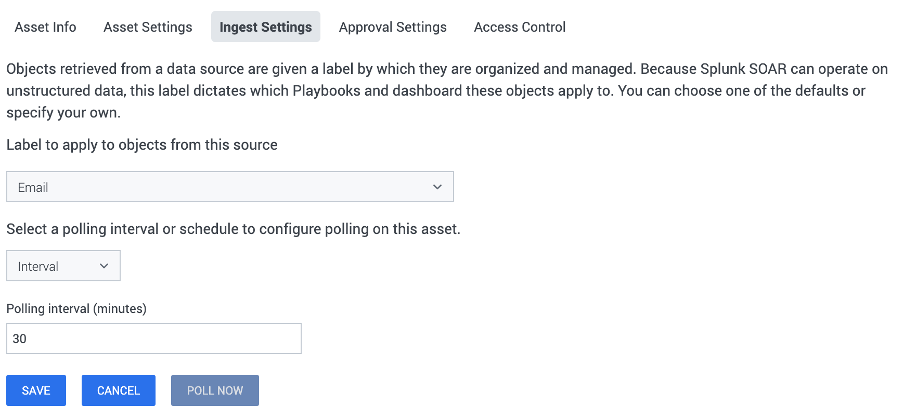
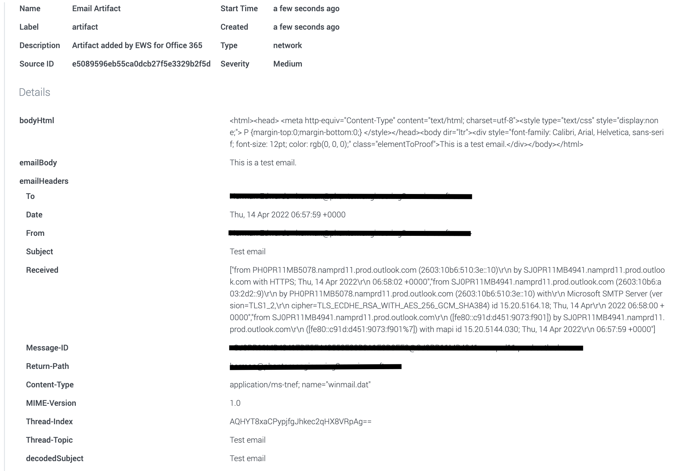

## SOAR asset setup

It is not uncommon for enterprises to have a single mailbox configured where users can forward
suspicious emails for further investigation. The ingestion feature in the Office 365 app is
primarily designed to pull emails from such a mailbox and create containers and artifacts in SOAR.

The first thing to do is create the Office 365 asset in SOAR and fill up the required parameters
like **url, username, password** , and **poll_user** . The other values can be left in the default
state for now. The same user can be used to log in/authenticate for the connectivity test and
polling, just specify the same email address in **poll_user** and **username** .

[](img/asset_info.png)

[](img/asset_settings.png)

However, it's good practice to set the Label for the objects from this source to a 'NEW ENTRY'
called **Email** .

[](img/ingest_settings.png)

Once the Asset and Ingest parameters are filled, save the asset.

## Authentication

This app supports multiple types of authentication mechanisms. Currently, there are five ways to
authenticate.

- Basic
- Azure
- Azure (interactive)
- Federated
- OAuth (client credentials)

For **Azure** , **Azure (interactive)** and **OAuth (client credentials)** mechanisms, you will
first need to create an application on the Azure AD Admin Portal. Follow the steps outlined below to
do this:

- Navigate to <https://portal.azure.com> in a browser and log in with a Microsoft account.
- Select **Azure Active Directory** from the list of Azure services.
- From the left panel, select **App Registrations** .
- At the top of the middle section, select **New registration** .
- On the next page, give your application a name and click **Register** .
- Once the app is created, the **Overview** page opens up. Copy the **Application (client) ID**
  value shown here. Paste this value in the **Client App ID for the Azure/Fed AD/OAuth
  Authentication** asset configuration parameter.
- Under **Certificates & secrets** select **New client secret** . Note down this key somewhere
  secure, as it cannot be retrieved after closing the window. Provide this value in the **Client
  Secret for the Azure/Fed AD/OAuth Authentication** asset configuration parameter.

Following are the instructions to setup different types of authentication.

1. ### Basic

   Basic is the most simple way to authenticate. All you need to provide to this is Username and
   Password.\
   **NOTE:** Microsoft is going to permanently disable Basic Authentication for EWS. Hence, we
   recommend the customers to switch from Basic to Azure Authentication mechanism. The default
   value of **Authentication Mechanism to Use** asset configuration parameter is therefore changed
   to **Azure** . We will be maintaining the **Basic** option for backward compatibility and for
   any legacy users. As the 'trace email' action uses Basic authentication, it will not be
   functional after Microsoft disables Basic authentication.

1. ### Azure

   To use this authentication mechanism, you will have to add some permissions to the app you
   created earlier. Follow the steps outlined below to do this:

   - Under **API Permissions** Click on **Add a permission** .

   - Under the **Select an API** section, select **APIs my organization uses** .

   - Search for the **Office 365 Exchange Online** keyword in the search box and click on the
     displayed option for it.

   - Provide the following Delegated permissions to the app.

     - EWS.AccessAsUser.All
     - Mail.Read
     - Mail.Read.All
     - User.ReadBasic.All (Only required if the asset is configured to use impersonation)

   - After making these changes, click **Add permissions** at the bottom of the screen, then
     click **Grant admin consent for SOAR** .

1. ### Azure (interactive)

   To use this authentication mechanism, you will have to add some permissions to the app you
   created earlier. Follow the steps outlined below to do this:

   - Under **Authentication** , select **Add a platform** . In the **Add a platform** window,
     select **Web** . The **Redirect URIs** should be filled right here. You will obtain the
     redirect URI from the **POST incoming for EWS Office 365 to this location** asset
     configuration parameter.\
     The URI should look similar to this:
     https://\<soar_host>/rest/handler/ewsforoffice365_a73f6d32-c9d5-4fec-b024-43876700daa6/\<asset_name>\
     Once the Redirect URI is filled, click **Configure** .

   - Under **API Permissions** Click on **Add a permission** .

   - Under the **Select an API** section, select **APIs my organization uses** .

   - Search for the **Office 365 Exchange Online** keyword in the search box and click on the
     displayed option for it.

   - Provide the following Delegated permissions to the app.

     - EWS.AccessAsUser.All
     - Mail.Read
     - Mail.Read.All
     - User.ReadBasic.All (Only required if the asset is configured to use impersonation)

   - After making these changes, click **Add permissions** at the bottom of the screen, then
     click **Grant admin consent for SOAR** .

   - Azure adds **Microsoft Graph's User.Read** permission to the app by default. Please confirm
     its presence under the Configured permissions list. If not added, you can manually click on
     **Add a permission** and follow the below steps:

     - Under the **Select an API** section, select **Microsoft APIs** .
     - Select **Microsoft Graph** from the list.
     - Provide the **User.Read** Delegated permission to the app.
     - After making these changes, click **Add permissions** at the bottom of the screen, then
       click **Grant admin consent for SOAR** .

   **Azure Interactive** is different because it will prompt the user to log in through Microsoft's
   portal during Test Connectivity, meaning you do not need to enter your password in the asset
   configuration. Instead:

   - Run **TEST CONNECTIVITY.**
   - You will be asked to open a link in a new tab. Open the link in the same browser window so
     that you are logged into Splunk SOAR for the redirect.
   - Proceed to login to the Microsoft site.
   - You will be prompted to agree to the permissions requested by the App.
   - If all goes well the browser should instruct you to close the tab.
   - Now go back and check the message on the Test Connectivity dialog box, it should say
     Connectivity test passed.

   NOTE: Do make sure the base URL is configured for the SOAR instance. You can check it here:
   Administration > Company Settings > Info.

1. ### OAuth (client credentials)

   To use this authentication mechanism, you will have to add some permissions to the app you
   created earlier. Follow the steps outlined below to do this:

   - Under **API Permissions** Click on **Add a permission** .
   - Under the **Select an API** section, select **APIs my organization uses** .
   - Search for the **Office 365 Exchange Online** keyword in the search box and click on the
     displayed option for it.
   - Provide the **full_access_as_app** Application permission to the app.
   - After making these changes, click **Add permissions** at the bottom of the screen, then
     click **Grant admin consent for SOAR** .

   NOTE: Make sure the **Use Impersonation** option is enabled in the asset while using this
   authentication mechanism. Once it is enabled, you should add email of the impersonating user to
   the action parameter wherever possible while executing an action.

1. ### Federated

   The Federated Authentication setup is quite complicated and its documentation is out of the
   scope of this section.\
   NOTE: Federated Authentication has been tested in a limited fashion.

NOTE: The user must test the connectivity every time they switch between different authentication
mechanisms.

## Impersonation

If you wish to use a single login user to read and modify multiple mailboxes (of multiple users),
proper permissions to allow impersonation must be enabled on the login user. If impersonation is not
enabled/working, you may need to enable it by configuring the roles for the user.

- First, log in to <https://outlook.office365.com/ecp/> as an admin user

- Click on **admin roles** under the **permissions** section

- Press the '+' button on the top left to create a new role group

  - Give the group a friendly name and description
  - Add the role **ApplicationImpersonation**
  - Assign the user to the members of this group

- Click save, and wait. These changes will take a while to affect. You may need to wait up to an
  hour for impersonation to start working in the App.

## Connectivity test

Once the asset is saved, run Test Connectivity and make sure it passes. The Test Connectivity action
attempts to read some information about the configured user's mailbox to validate the Auth
parameters. Exchange Web Services API is used for all the actions. Impersonation is also used if
configured.

[](img/testing_connectivity.png)

Now that the config is out of the way, let's delve into the two modes that ingestion can occur and
the differences between them. One thing to note is that for every email that is ingested, a single
container is created containing multiple artifacts.

## POLL NOW

POLL NOW should be used to get a sense of the containers and artifacts that are created by the app.
The POLL NOW window allows the user to set the "Maximum containers" that should be ingested at this
instance. Since a single container is created for each email, this value equates to the maximum
number of emails that are ingested by the app. The app will either get the oldest email first or the
latest, depending upon the configuration parameter *How to ingest* . The date used to determine the
oldest or latest is what EWS calls **item:LastModifiedTime** . This value is different than the mail
creation time. For example, if an email that arrived a week ago, is moved from one folder to the
folder being ingested, its LastModifiedTime will be set to the time that it was moved.

## Scheduled Polling

This mode is used to schedule a polling action on the asset at regular intervals, which is
configured via the INGEST SETTINGS tab of the asset. It makes use of the following asset
configuration parameters (among others):

- Maximum emails to poll the first time

  The app detects the first time it is polling an asset and will ingest this number of emails (at
  the most).

- Maximum emails to poll

  For all scheduled polls after the first, the app will ingest this number of emails.

- How to ingest

  Should the app be ingesting the latest emails or the oldest.

In the case of Scheduled Polling, on every poll, the app remembers the last email that it has
ingested and will pick up from the next one in the next scheduled poll.

## How to ingest

The app allows the user to configure how it should ingest emails on every scheduled poll either in
the *oldest first* or the *latest first* order. Depending upon the scheduled interval and how busy
the folder is, one of the following could potentially happen

- oldest first

  If the app is configured to poll too slowly and the folder is so busy that on every poll the
  maximum ingested emails is less than the number of new emails, the app will never catch up.

- latest first

  If the app is configured to poll too slowly and the folder is so busy that on every poll the
  maximum ingested emails is less than the number of new emails, the app will drop the older
  emails since it is ingesting the latest emails that came into the mailbox.

For best results, keep the poll interval and *Maximum emails to poll* values close to the number of
emails you would get within a time interval. This way, every poll will end up ingesting all the new
emails.

## Containers created

As mentioned before, the app will create a single container for each email that it ingests with the
following properties:

- Name

  The email subject is used as the name of the container. If a subject is not present the
  generated name is set to the unique message ID that office 365 assigns to every mail in the
  mailboxes

- Source ID

  The source ID of the container will be set to the unique message id.

- Data Key

  The Container dictionary contains a data section that looks like the following:

  ```
  "data": { "raw_email": "...Parsed Email....", "base64encoded": False}
  ```

  If the App decides to encode the raw_email in base64, the *base64encoded* key will be set to
  True

## Artifacts created

The app will create the following type of artifacts:

- Email Artifact

  The email addresses that are found in the ingested email will be added as a separate artifact.
  Any attached email will also be scanned and the address present in the attached email will be
  added as a separate artifact. The emails are added as custom strings in the cef structure in the
  following manner.\
  [](img/email_artifact.png)

- IP Artifact

  - If **extract_ips** is enabled, any IPv4 or IPv6 found in the email body will be added, with
    one CEF per IP.
  - Any IP addresses found in the email are added to the CEF structure of an artifact.
  - The CEF for an IP is cef.sourceAddress.

- Hash Artifact - cef.fileHash

  - If **extract_hashes** is enabled, any hash found in the email body will be added, with one
    CEF per hash.
  - Any Hashes found in the email are added to the CEF structure of an artifact.
  - The CEF for a hash is cef.fileHash.

- URL Artifact - cef.requestURL

  - If **extract_urls** is enabled, any url found in the email body will be added, with one CEF
    per url.
  - Any URLs found are added to the CEF structure of an artifact.
  - The CEF for a URL is cef.requestURL.

- Domain Artifact - cef.destinationDnsDomain

  - If **extract_domains** is enabled, any domain found in the email body will be added, with
    one CEF per domain.
  - Domains that are part of a URL or an email address are added to the CEF structure of an
    artifact.
  - The CEF for a URL is cef.destinationDnsDomain.

- Vault Artifact

  - If the email contains any attachments, these are extracted (if **extract_attachments** is
    enabled) and added to the vault of the Container.
  - At the same time, the vault ID and file name of this item is represented by a Vault
    Artifact.
  - The same file can be added to the vault multiple times. In this scenario, the file name of
    the item added the second time onwards will be slightly different, but the vault ID will
    still be the same. However, there will be multiple artifacts created.
  - Do note that the system does *not* duplicate the file bytes, only the metadata in the
    database.
  - You will notice additional CEF fields **cs6** (value is the Vault ID) and **cs6Label** .
    These are added for backward compatibility only and will be deprecated in future releases.
    Please don't use these keys in playbooks.

  [](img/vault_artifact.png)

## Guidelines to provide folder path parameter value

This is applicable to 'copy email', 'move email', and 'run query' actions.

- To specify the complete path, use the **'/'** (forward slash) as the separator.
- If a folder name has a literal forward slash in the name escape it with a **'\\'** (backslash)
  to differentiate.
- For example, to search in a folder named **test/exp** which is nested within (is a child of)
  **Inbox** , set the value as **Inbox/test\\/exp** .

## outlookmsgfile

This app uses the outlookmsgfile module, which is licensed under the MIT License, Copyright (c) 2018
Joshua Tauberer.

## compoundfiles

This app uses the compoundfiles module, which is licensed under the MIT License, Copyright (c) 2014
Dave Jones.

## compressed_rtf

This app uses the compressed_rtf module, which is licensed under the MIT License, Copyright (c) 2016
Dmitry Alimov.

## Preprocessing Containers

It is possible to upload your own script which has functions to handle preprocessing of containers.
The artifacts which are going to be added with the container can be accessed through this container
as well. This function should accept a container and return the updated container. Also note that
the name of this function must be **preprocess_container** .

```shell
import urlparse


def get_host_from_url(url):
    return urlparse.urlparse(url).hostname


def preprocess_container(container):

    # Match urls like https://secure.contoso.com/link/https://www.google.com
    # We want to strip 'https://secure.contoso.com/link/', and instead create
    #  a URL artifact for 'https://www.google.com'
    url_prepend = 'https://secure.contoso.com/link/'
    domain_prepend = 'secure.contoso.com'

    new_artifacts = []

    for artifact in container.get('artifacts', []):
        cef = artifact.get('cef')
        url = cef.get('requestURL')
        if url and url.lower().startswith(url_prepend):
            url = url.replace(url_prepend, '')
            artifact['cef']['requestURL'] = url
            # Create a new domain artifact for this URL
            new_artifacts.append({
                'name': 'Domain Artifact',
                'cef': {
                    'destinationDnsDomain': get_host_from_url(url)
                }
            })

        domain = cef.get('destinationDnsDomain')
        if domain and domain.lower() == domain_prepend:
            # These are the wrong domains, ignore them
            continue

        new_artifacts.append(artifact)

    if new_artifacts:
        new_artifacts[-1]['run_automation'] = True

    container['artifacts'] = new_artifacts
    return container
```

In this example, many of the URLs have 'https://secure.contoso.com/link' appended to the start of
them. These URL artifacts will be tough to use in a playbook without additional processing. On top
of that, all of the associated domain artifacts will be incorrect as well, since they will all point
to 'secure.contoso.com'.

## Increase the maximum limit for ingestion

The steps are as follows:

1. Open the **/opt/phantom/usr/nginx/conf/conf.d/phantom-nginx-server.conf** file on the SOAR
   instance.
1. Change that value of the **client_max_body_size** variable as per your needs.
1. Save the configuration file.
1. Reload nginx service using **service nginx reload** or try restarting the nginx server from SOAR
   platform: Go to **Administrator->System Health-> System Health** then restart the nginx server.

## Port Information

The app uses HTTP/ HTTPS protocol for communicating with the Office365 server. Below are the default
ports used by Splunk SOAR.

|         Service Name | Transport Protocol | Port |
|----------------------|--------------------|------|
|         http | tcp | 80 |
|         https | tcp | 443 |
